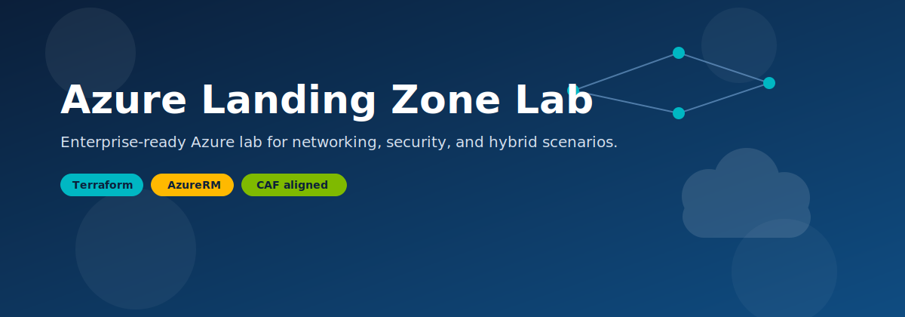
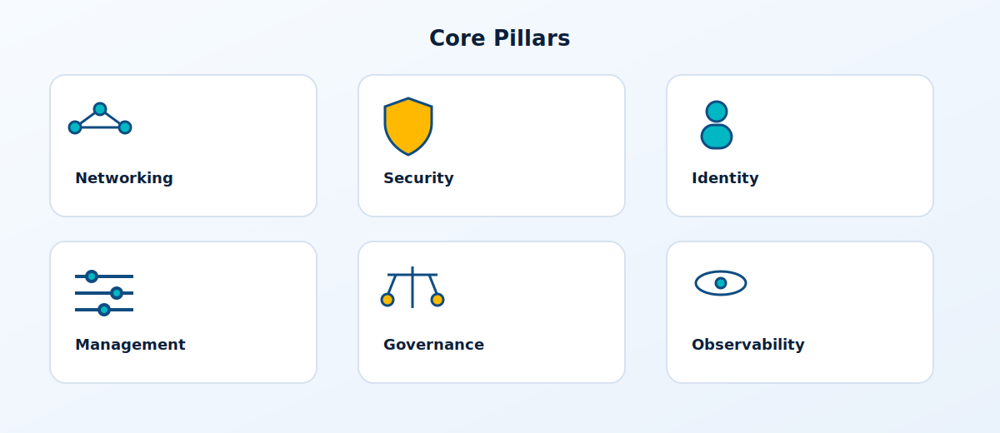
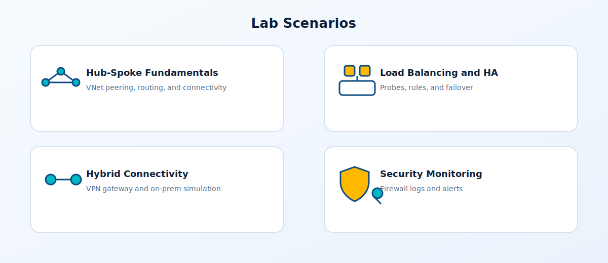
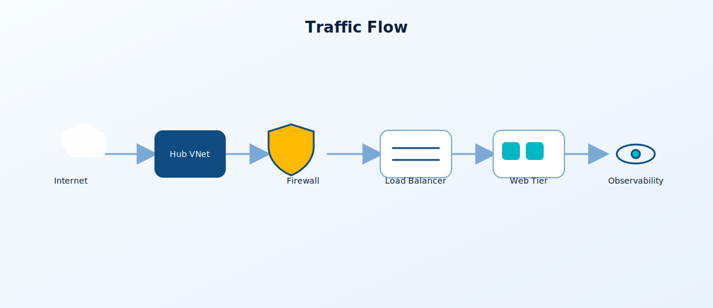
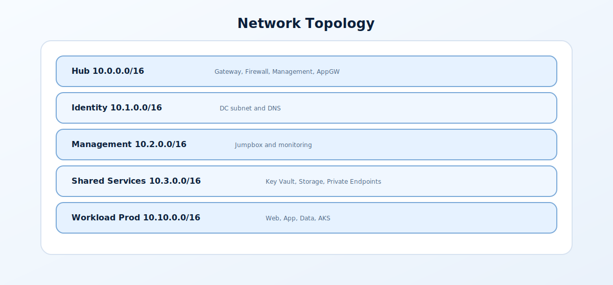
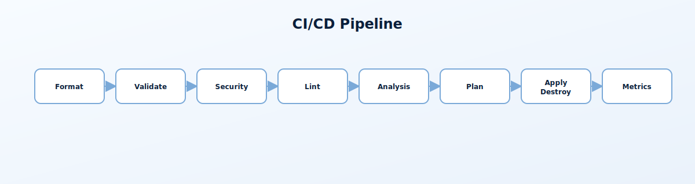

# 🏗️ Azure Landing Zone Lab

[](https://terraform.io)
[](https://azure.microsoft.com)
[](https://registry.terraform.io/providers/Azure/azapi/latest)
[](LICENSE)

<p align="center">
  
</p>

<p align="center">
  
</p>


Learn Azure the right way—by building it. This Terraform project deploys a complete enterprise cloud environment you can explore, break, and rebuild. Covers networking, security, hybrid connectivity, containers, and Windows workloads following Microsoft Cloud Adoption Framework (CAF) best practices.

> 💡 **Hands-on Learning**: Deploy real enterprise infrastructure in minutes. Perfect for Azure certifications (AZ-104, AZ-305, AZ-700), team training, or validating architectures before production.

## 🎛️ Master Control Panel (feature toggles)

At the top of `terraform.tfvars` there is a **MASTER CONTROL PANEL** section that contains all the main `deploy_*` / `enable_*` switches in one place. Flip those values to quickly change what gets deployed, then run `terraform plan` and `terraform apply`.

---

## 📋 Table of Contents

- [Overview](#-overview)
- [Architecture Diagram](#-architecture-diagram)
- [Lab Scenarios](#-lab-scenarios)
- [What Gets Deployed](#-what-gets-deployed)
- [Optional Components](#-optional-components)
- [Network Add-Ons & Observability](#-network-add-ons--observability)
- [Network Topology](#-network-topology)
- [Traffic Flow](#-traffic-flow)
- [Quick Start](#-quick-start)
- [CI/CD Pipeline](#-cicd-pipeline)
- [Configuration Options](#-configuration-options)
- [Testing the Environment](#-testing-the-environment)
- [Security Features](#-security-features)
- [Cost Estimation](#-cost-estimation)
- [Troubleshooting](#-troubleshooting)
- [License](#-license)

---

## 🎯 Overview

This Terraform project creates a complete Azure Landing Zone lab environment that simulates an enterprise hybrid cloud setup. Perfect for learning, training, and proof-of-concept work.

### Core Components (Always Deployed)
- **🌐 Hub-Spoke Network Topology** - Centralized connectivity with VNet peering
- **🔐 Identity Services** - Windows Server 2022 Domain Controller (DC01)
- **🖥️ Management Zone** - Jumpbox VM with public IP for secure RDP access
- **🔑 Shared Services** - Azure Key Vault for secrets, Storage Account for file shares
- **📊 Monitoring** - Log Analytics workspace with 30-day retention

### Configurable Components
- **🛡️ Azure Firewall** (~$350/mo) - Central network security with DNAT/SNAT rules
- **⚖️ Load Balanced Web Tier** - IIS Web Servers behind Azure Load Balancer
- **🗄️ Azure SQL Database** - Managed SQL with optional private endpoint
- **🔗 VPN Gateway** (~$140/mo) - Site-to-site VPN for hybrid scenarios
- **🏠 Simulated On-Premises** - VPN Gateway + File Server for hybrid testing
- **☸️ Azure Kubernetes Service (AKS)** - Managed Kubernetes cluster
- **🛡️ Application Gateway with WAF** (~$36/mo) - Layer 7 load balancing
- **🔒 Private Endpoints** - Private Link for Key Vault, Storage, SQL
- **🌐 NAT Gateway** - Fixed outbound IP for workload subnet

## 🔌 Network Add-Ons & Observability

Enable these when you need tighter control or visibility. Check prerequisites to avoid failed plans:

| Flag | What it adds | Prerequisites | Cost |
|------|--------------|---------------|------|
| `deploy_nat_gateway` | Fixed outbound IP for workload web subnet | `deploy_workload_prod = true` | ~$4-5/mo + data |
| `deploy_private_dns_zones` | Central Private DNS for blob, Key Vault, SQL | Hub RG present | Minimal |
| `deploy_private_endpoints` | Private Link for Key Vault, Storage, SQL | `deploy_private_dns_zones = true` | None |
| `deploy_application_security_groups` | ASGs for web/app/data tiers | `deploy_workload_prod = true` | None |
| `enable_vnet_flow_logs` | VNet flow logs to storage (replaces NSG flow logs) | `deploy_storage = true`, Network Watcher | Storage ingest |
| `enable_traffic_analytics` | Traffic flow visualization | `enable_vnet_flow_logs`, `deploy_log_analytics`, `deploy_storage` | Log Analytics ingest |
| `create_network_watcher` | Creates NetworkWatcherRG if missing | Set true only for new subscriptions | None |

> **Note**: VNet Flow Logs are the modern replacement for NSG Flow Logs (retired June 2025). Uses **AzAPI** provider.

### ☁️ PaaS Services (Cloud-Native Workloads)

All PaaS services are **optional** and controlled via deployment flags:

| Service | Flag | Tier | Monthly Cost |
|---------|------|------|-------------|
| 🔷 **Azure Functions** | `deploy_functions` | Y1 Consumption | **FREE** |
| 🌐 **Static Web Apps** | `deploy_static_web_app` | Free | **FREE** |
| ⚡ **Logic Apps** | `deploy_logic_apps` | Consumption | ~$0 (pay per run) |
| 📬 **Event Grid** | `deploy_event_grid` | Standard | **FREE** (100k ops) |
| 🚌 **Service Bus** | `deploy_service_bus` | Basic | ~$0.05/month |
| 🌍 **App Service** | `deploy_app_service` | F1 Free | **FREE** |
| 🗃️ **Cosmos DB** | `deploy_cosmos_db` | Serverless | ~$0-5/month |

> **Note**: `deploy_container_apps` exists as a placeholder flag but is not currently wired to a module.


### 🎯 Use Cases

| Use Case | Description |
|----------|-------------|
| 🎓 **Learning** | Practice Azure networking, security, load balancing, and IaC |
| 🧪 **Testing** | Validate architectures before production deployment |
| 📚 **Training** | Teach teams about Azure Landing Zones and CAF |
| 🔬 **PoC** | Quickly spin up proof-of-concept environments |
| 🏆 **Certification Prep** | Hands-on practice for AZ-104, AZ-305, AZ-700 exams |

---

## ⚡ Deployment Profiles

| Profile | Components | Deploy Time | Est. Monthly Cost |
|---------|------------|-------------|------------------|
| **Minimal** | Core VNets + Identity + Management (no Firewall) | ~8 min | ~$100-150 |
| **Standard** | Minimal + Firewall + Load Balancer + IIS | ~15 min | ~$450-500 |
| **Standard + PaaS** | Standard + All PaaS Services | ~25 min | ~$500-550 |
| **Full Hybrid** | Standard + VPN + On-Prem Simulation | ~45 min | ~$650-700 |
| **Enterprise** | Full Hybrid + AKS + App Gateway | ~55 min | ~$850-950 |

> **Current Default Config** (`terraform.tfvars`): Standard + PaaS + Network Add-ons + Dev VNet (VPN/AKS/Flow Logs/Backup off; ~$500-600/month)

---

## 🏛️ Architecture Diagram

<p align="center">
  
</p>

```
┌──────────────────────────────────────────────────────────────────────────────────────────────────────────────────────┐
│                                              AZURE CLOUD                                                              │
│                                                                                                                       │
│                                                 INTERNET                                                              │
│                                                     │                                                                 │
│                          ┌──────────────────────────┼──────────────────────────┐                                      │
│                          │                          │                          │                                      │
│                          ▼                          ▼                          ▼                                      │
│  ┌───────────────────────────────────────────────────────────────────────────────────────────────────────────────┐   │
│  │                                      HUB VNET (10.0.0.0/16)                                                    │   │
│  │                                                                                                                │   │
│  │   ┌─────────────────┐    ┌─────────────────┐    ┌─────────────────┐    ┌─────────────────┐                     │   │
│  │   │  GatewaySubnet  │    │ AzureFirewall   │    │   AppGateway    │    │  Management     │                     │   │
│  │   │  10.0.0.0/24    │    │  Subnet         │    │   Subnet        │    │  Subnet         │                     │   │
│  │   │                 │    │  10.0.1.0/24    │    │   10.0.3.0/24   │    │  10.0.2.0/24    │                     │   │
│  │   │  ┌───────────┐  │    │                 │    │                 │    └─────────────────┘                     │   │
│  │   │  │    VPN    │  │    │  ┌───────────┐  │    │  ┌───────────┐  │                                            │   │
│  │   │  │  Gateway  │  │    │  │  Azure    │  │    │  │  App GW   │  │        ┌─────────────────────────────┐     │   │
│  │   │  │[OPTIONAL] │  │    │  │ Firewall  │  │    │  │   WAF     │  │        │  📊 Azure Monitor           │     │   │
│  │   │  └───────────┘  │    │  │ (SNAT/    │  │    │  │[OPTIONAL] │  │        │  • Log Analytics           │     │   │
│  │   │       │         │    │  │  DNAT)    │  │    │  └───────────┘  │        │  • Diagnostic Settings     │     │   │
│  │   └───────┼─────────┘    │  └───────────┘  │    └─────────────────┘        │  • Metric Alerts           │     │   │
│  │           │              │       │         │                               └─────────────────────────────┘     │   │
│  │           │              └───────┼─────────┘                                                                   │   │
│  └───────────┼──────────────────────┼─────────────────────────────────────────────────────────────────────────────┘   │
│              │                      │                                                                                 │
│   ═══════════╬══════════════════════╬═════════════════════════════════════════════════════════════════════════════    │
│   VPN Tunnel ║                      │            VNet Peerings (Hub-Spoke Topology)                                   │
│   ═══════════╬══════════════════════╬═════════════════════════════════════════════════════════════════════════════    │
│              ║                      │                                                                                 │
│              ║          ┌───────────┴────────────────┬────────────────┬────────────────────────┐                     │
│              ║          │                            │                │                        │                     │
│              ▼          ▼                            ▼                ▼                        ▼                     │
│  ┌───────────────────┐ ┌──────────────────┐  ┌──────────────────┐  ┌──────────────────┐  ┌───────────────────────┐   │
│  │   ON-PREMISES     │ │   IDENTITY       │  │   MANAGEMENT     │  │    SHARED        │  │   WORKLOAD PROD       │   │
│  │   (Simulated)     │ │   10.1.0.0/16    │  │   10.2.0.0/16    │  │   SERVICES       │  │   10.10.0.0/16        │   │
│  │   [OPTIONAL]      │ │                  │  │                  │  │   10.3.0.0/16    │  │                       │   │
│  │   10.100.0.0/16   │ │ ┌──────────────┐ │  │ ┌──────────────┐ │  │                  │  │ ┌───────────────────┐ │   │
│  │                   │ │ │     DC01     │ │  │ │   Jumpbox    │ │  │ ┌──────────────┐ │  │ │   Web Subnet      │ │   │
│  │ ┌───────────────┐ │ │ │  (Win 2022)  │ │  │ │  (Win 2022)  │ │  │ │  Key Vault   │ │  │ │   10.10.1.0/24    │ │   │
│  │ │  File Server  │ │ │ │  10.1.1.4    │ │  │ │  10.2.1.4    │ │  │ └──────────────┘ │  │ │                   │ │   │
│  │ │  (Win 2022)   │ │ │ └──────────────┘ │  │ └──────────────┘ │  │ ┌──────────────┐ │  │ │  ┌─────┐ ┌─────┐  │ │   │
│  │ │  10.100.1.4   │ │ │ ┌──────────────┐ │  │ ┌──────────────┐ │  │ │   Storage    │ │  │ │  │Web01│ │Web02│  │ │   │
│  │ └───────────────┘ │ │ │     DC02     │ │  │ │     Log      │ │  │ │   Account    │ │  │ │  │ IIS │ │ IIS │  │ │   │
│  │ ┌───────────────┐ │ │ │  [Optional]  │ │  │ │  Analytics   │ │  │ └──────────────┘ │  │ │  └─────┘ └─────┘  │ │   │
│  │ │  VPN Gateway  │ │ │ │  10.1.1.5    │ │  │ └──────────────┘ │  │ ┌──────────────┐ │  │ │        ▲          │ │   │
│  │ │  [OPTIONAL]   │ │ │ └──────────────┘ │  └──────────────────┘  │ │   SQL DB     │ │  │ │  Load Balancer   │ │   │
│  │ └───────────────┘ │ └──────────────────┘                        │ │  (Private    │ │  │ └───────────────────┘ │   │
│  └───────────────────┘                                             │ │   Endpoint)  │ │  │ ┌───────────────────┐ │   │
│                                                                    │ └──────────────┘ │  │ │   AKS Subnet      │ │   │
│                                                                    └──────────────────┘  │ │   [OPTIONAL]      │ │   │
│                                                                                          │ │   10.10.16.0/20   │ │   │
│                                                                                          │ └───────────────────┘ │   │
│                                                                                          └───────────────────────┘   │
└──────────────────────────────────────────────────────────────────────────────────────────────────────────────────────┘

                                    ┌────────────────────────────────────┐
                                    │        LEGEND                      │
                                    │  ═══ VPN Tunnel                    │
                                    │  ─── VNet Peering                  │
                                    │  [OPTIONAL] = Configurable         │
                                    └────────────────────────────────────┘
```

### Architecture at a Glance

- **Topology**: Hub VNet with optional VPN/App Gateway; peered spokes for identity, management, shared services, and workload. On-premises simulation connects via site-to-site VPN when enabled.
- **Connectivity Control**: Azure Firewall centralizes egress; workload web subnet skips a firewall UDR when using a public LB to avoid asymmetric return paths; optional NAT Gateway gives the web subnet a fixed outbound IP.
- **Name Resolution**: Identity DNS servers are shared across spokes; optional Private DNS zones in the hub cover blob, Key Vault, and SQL Private Link.
- **Segmentation**: NSGs on every subnet; optional Application Security Groups group web/app/data tiers for cleaner rules.
- **Observability**: Log Analytics workspace lives in management; optional VNet Flow Logs go to storage with Traffic Analytics; enable `create_network_watcher` if your subscription lacks NetworkWatcherRG.

---

## 🧪 Lab Scenarios

<p align="center">
  
</p>


This landing zone supports multiple hands-on lab scenarios for learning and testing. Each scenario builds on the core infrastructure.

### Scenario 1: Hub-Spoke Network Fundamentals
**Objective**: Understand Azure networking concepts and hub-spoke topology

| Task | Skills Practiced |
|------|------------------|
| Explore VNet peering connections | Virtual network peering, traffic flow |
| Test connectivity between spokes via hub | Route tables, UDRs |
| Analyze Azure Firewall logs | Network security, logging |
| Configure custom NSG rules | Network security groups |

```bash
# Deploy minimal infrastructure
deploy_firewall         = true
deploy_vpn_gateway      = false
deploy_onprem_simulation = false
```

### Scenario 2: Load Balancing & High Availability
**Objective**: Learn Azure Load Balancer concepts and IIS web server deployment

| Task | Skills Practiced |
|------|------------------|
| Test load balancer distribution | 5-tuple hash, health probes |
| Simulate VM failure (stop a VM) | Backend pool health, failover |
| Configure custom health probes | HTTP probes, intervals |
| Access VMs via NAT rules | Inbound NAT, port mapping |

```bash
# Test load balancing
curl http://<lb_frontend_ip>  # Observe round-robin between web01-prd and web02-prd

# RDP to individual servers
mstsc /v:<lb_frontend_ip>:3389  # web01
mstsc /v:<lb_frontend_ip>:3390  # web02
```

### Scenario 3: Hybrid Connectivity (VPN)
**Objective**: Configure site-to-site VPN and hybrid networking

| Task | Skills Practiced |
|------|------------------|
| Establish VPN tunnel | IPsec, IKE configuration |
| Test on-prem to Azure connectivity | VPN troubleshooting |
| Configure BGP routing (optional) | Dynamic routing, ASN |
| Access Azure resources from "on-prem" | Hybrid network design |

```bash
# Enable hybrid scenario
deploy_vpn_gateway       = true
deploy_onprem_simulation = true
enable_bgp               = true  # Optional: Enable BGP routing
```

### Scenario 4: Azure Firewall & Security
**Objective**: Implement network security controls

| Task | Skills Practiced |
|------|------------------|
| Create application rules | FQDN filtering, web categories |
| Configure network rules | IP-based filtering, protocols |
| Set up DNAT rules | Inbound traffic, port forwarding |
| Analyze threat intelligence logs | Security monitoring |

```powershell
# From jumpbox, test firewall rules
Test-NetConnection -ComputerName google.com -Port 443
Invoke-WebRequest -Uri https://ifconfig.me  # Check SNAT IP
```

### Scenario 5: Containers with AKS
**Objective**: Deploy and manage Kubernetes workloads

| Task | Skills Practiced |
|------|------------------|
| Connect to AKS cluster | kubectl, Azure CLI |
| Deploy sample application | Kubernetes deployments |
| Configure ingress | Service exposure, networking |
| Integrate with Log Analytics | Container monitoring |

```bash
# Enable AKS
deploy_aks = true

# Connect to cluster
az aks get-credentials --resource-group rg-workload-prod-lab-<location_short> --name aks-prod-lab-<location_short>
kubectl get nodes
```

### Scenario 6: PaaS Services & Private Endpoints
**Objective**: Work with Azure PaaS services securely

| Task | Skills Practiced |
|------|------------------|
| Access Key Vault secrets | Secret management, RBAC |
| Connect to SQL via private endpoint | Private Link, DNS |
| Upload files to Storage Account | Blob storage, access tiers |
| Test Azure Functions | Serverless compute |

```powershell
# From jumpbox, access Key Vault
$secret = Get-AzKeyVaultSecret -VaultName "kv-azlab-xxxx" -Name "admin-password"

# Test SQL connectivity
Test-NetConnection -ComputerName "sql-xxxx.database.windows.net" -Port 1433
```

### Scenario 7: Monitoring & Alerting
**Objective**: Implement Azure Monitor for infrastructure

| Task | Skills Practiced |
|------|------------------|
| Review Log Analytics queries | KQL, log analysis |
| Create custom alerts | Metric alerts, action groups |
| Configure diagnostic settings | Resource logging |
| Build monitoring dashboards | Azure Dashboards, workbooks |

```kusto
// Sample KQL query for VM performance
Perf
| where ObjectName == "Processor" and CounterName == "% Processor Time"
| summarize avg(CounterValue) by Computer, bin(TimeGenerated, 5m)
| render timechart
```

### Scenario 8: Application Gateway & WAF
**Objective**: Implement Layer 7 load balancing with WAF

| Task | Skills Practiced |
|------|------------------|
| Configure backend pools | Health probes, routing |
| Test WAF rules | OWASP protection, custom rules |
| Set up URL path-based routing | Multi-site hosting |
| Analyze WAF logs | Security investigation |

```bash
# Enable Application Gateway
deploy_application_gateway = true
appgw_waf_mode             = "Detection"  # or "Prevention"
```

---

## 📊 Lab Progress Tracker

Use this checklist to track your learning progress:

- [ ] **Core Infrastructure**
  - [ ] Deployed hub-spoke topology
  - [ ] Verified VNet peering connectivity
  - [ ] Tested Azure Firewall egress
  - [ ] Accessed jumpbox via RDP/Bastion

- [ ] **Load Balancing**
  - [ ] Tested HTTP load balancing
  - [ ] Verified health probe behavior
  - [ ] Used NAT rules for RDP access
  - [ ] Stopped a VM and verified failover

- [ ] **Security**
  - [ ] Reviewed NSG rules
  - [ ] Created custom firewall rules
  - [ ] Accessed Key Vault secrets
  - [ ] Analyzed security logs

- [ ] **Hybrid Networking** (Optional)
  - [ ] Established VPN tunnel
  - [ ] Tested cross-premises connectivity
  - [ ] Configured BGP (if enabled)

- [ ] **Containers** (Optional)
  - [ ] Deployed AKS cluster
  - [ ] Connected with kubectl
  - [ ] Deployed sample workload

- [ ] **Monitoring**
  - [ ] Queried Log Analytics
  - [ ] Created custom alert
  - [ ] Built monitoring dashboard

---

## 🔄 Traffic Flow

<p align="center">
  
</p>


### Network Traffic Patterns

```
┌─────────────────────────────────────────────────────────────────────────────────────────┐
│                                    TRAFFIC FLOWS                                         │
└─────────────────────────────────────────────────────────────────────────────────────────┘

  INTERNET                   INTERNET                    INTERNET
      │                          │                           │
      ▼                          ▼                           ▼
┌───────────┐            ┌───────────────┐            ┌───────────────┐
│   Azure   │            │    Public     │            │  Application  │
│ Firewall  │            │ Load Balancer │            │   Gateway     │
│  (SNAT)   │            │               │            │   (WAF)       │
└─────┬─────┘            └───────┬───────┘            └───────┬───────┘
      │                          │                           │
      ▼                          ▼                           ▼
┌───────────────┐        ┌───────────────┐            ┌───────────────┐
│ Spoke VNets   │        │  Web Servers  │            │  Web Servers  │
│ (Egress Only) │        │  (Direct LB)  │            │  (via AppGW)  │
└───────────────┘        └───────────────┘            └───────────────┘

Flow 1: Outbound         Flow 2: Inbound              Flow 3: WAF
(All Spokes)             (Load Balancer)              (App Gateway)
```

### Flow Details

| Flow | Path | Use Case |
|------|------|----------|
| **Outbound (SNAT)** | VM → Azure Firewall → Internet | All spoke VMs accessing internet |
| **Load Balancer** | Internet → Public LB → Web VMs | Direct HTTP/HTTPS to web tier |
| **App Gateway** | Internet → App GW (WAF) → Web VMs | WAF-protected web traffic |
| **Spoke-to-Spoke** | Spoke A → Hub Firewall → Spoke B | Cross-spoke communication |
| **VPN Tunnel** | On-Prem → VPN GW → Hub → Spokes | Hybrid connectivity |

### Why Web Subnet Bypasses Firewall

When using a **Public Load Balancer**, the web subnet must have direct internet routing to avoid **asymmetric routing**:

| Scenario | Inbound Path | Outbound Path | Result |
|----------|--------------|---------------|--------|
| ❌ Web subnet with FW route | LB → VM | VM → Firewall → Internet | **Broken** (TCP fails) |
| ✅ Web subnet direct | LB → VM | VM → Internet | **Works** (symmetric) |

The configuration automatically excludes the web subnet from firewall routing when the public load balancer is enabled.

---

## 📦 What Gets Deployed

### Resource Groups

| Resource Group | Purpose | Key Resources |
|----------------|---------|---------------|
| `rg-hub-{env}-{location}` | Hub networking | VNet, Azure Firewall*, VPN Gateway*, App Gateway* |
| `rg-identity-{env}-{location}` | Identity services | VNet, Domain Controller (DC01), DC02* |
| `rg-management-{env}-{location}` | Operations | VNet, Jumpbox VM, Log Analytics |
| `rg-shared-{env}-{location}` | Shared services | VNet, Key Vault, Storage Account, SQL Database* |
| `rg-workload-prod-{env}-{location}` | Production workload | VNet, Load Balancer*, Web Servers*, AKS*, PaaS* |
| `rg-workload-dev-{env}-{location}` | Development workload | VNet, similar to prod* |
| `rg-onprem-{env}-{location}` | Simulated on-prem | VNet, VPN Gateway, File Server* |

> \* = Optional, controlled by deployment flags

### Resource Count by Configuration

| Configuration | Approximate Resources |
|---------------|----------------------|
| **Minimal** (No firewall, no LB) | ~60-80 |
| **Standard** (Firewall + LB + IIS) | ~130-150 |
| **Standard + PaaS** | ~170-190 |
| **Full Hybrid** (+ VPN + On-prem) | ~190-210 |
| **Enterprise** (+ AKS + AppGW) | ~220-250 |

### Core Infrastructure Breakdown

| Category | Resources | Count |
|----------|-----------|-------|
| **Networking** | VNets, Subnets, NSGs, Route Tables, Peerings | ~30-40 |
| **Security** | Azure Firewall, Firewall Policy, Rule Collections | ~8-10 |
| **Compute** | VMs (DC, Jumpbox, Web Servers), NICs, Disks | ~15-25 |
| **Load Balancing** | Load Balancer, Backend Pool, Health Probes, Rules | ~8-10 |
| **Storage** | Storage Account, Key Vault, File Shares | ~5-8 |
| **Database** | Azure SQL Server, Database, Private Endpoint | ~3-5 |
| **Monitoring** | Log Analytics, Diagnostic Settings, Alerts | ~15-25 |
| **Identity** | Managed Identities, RBAC Assignments | ~5 |

### Load Balancer Configuration

| Resource | Configuration | Purpose |
|----------|---------------|---------|
| **Public Load Balancer** | Standard SKU | Distributes HTTP traffic |
| **Frontend IP** | Static public IP | Internet entry point |
| **Backend Pool** | 2 Web Servers | Target VMs |
| **Health Probe** | HTTP/80, 5s interval | VM health monitoring |
| **LB Rule (HTTP)** | TCP/80 → 80 | Web traffic distribution |
| **LB Rule (HTTPS)** | TCP/443 → 443 | Secure web traffic |
| **NAT Rule (RDP web01)** | TCP/3389 → 3389 | Direct RDP to web01 |
| **NAT Rule (RDP web02)** | TCP/3390 → 3389 | Direct RDP to web02 |
| **Outbound Rule** | SNAT via LB PIP | Outbound internet access |

### Web Servers (IIS)

| Resource | Configuration | Purpose |
|----------|---------------|---------|
| **web01-prd** | Windows Server 2022 Core, Standard_B1ms | IIS Web Server |
| **web02-prd** | Windows Server 2022 Core, Standard_B1ms | IIS Web Server |
| **IIS Extension** | CustomScriptExtension | Auto-install IIS + custom page |

### Monitoring & Alerting

| Resource | Configuration |
|----------|---------------|
| **Log Analytics Workspace** | 30-day retention, 1GB daily quota |
| **Diagnostic Settings** | Azure Firewall, VPN Gateway, App Gateway |
| **CPU Alert** | VM CPU > 80% for 5 minutes |
| **Disk Read Alert** | Disk read ops > 100/s |
| **Firewall Alert** | Throughput anomaly detection |
| **Action Group** | Email notifications |

---

## 🌐 Network Topology

<p align="center">
  
</p>


### Address Space Allocation

| Network | CIDR | Purpose |
|---------|------|---------|
| **Hub** | 10.0.0.0/16 | Central connectivity hub |
| ├─ GatewaySubnet | 10.0.0.0/24 | VPN Gateway |
| ├─ AzureFirewallSubnet | 10.0.1.0/24 | Azure Firewall |
| ├─ ManagementSubnet | 10.0.2.0/24 | Hub management |
| └─ AppGatewaySubnet | 10.0.3.0/24 | Application Gateway |
| **Identity** | 10.1.0.0/16 | Domain Controllers |
| └─ DCSubnet | 10.1.1.0/24 | DC01 (10.1.1.4), DC02 (10.1.1.5) |
| **Management** | 10.2.0.0/16 | Operations |
| └─ JumpboxSubnet | 10.2.1.0/24 | Jumpbox (10.2.1.4) |
| **Shared** | 10.3.0.0/16 | Shared services |
| ├─ AppSubnet | 10.3.1.0/24 | Application tier |
| └─ PrivateEndpointSubnet | 10.3.2.0/24 | Private endpoints |
| **Workload Prod** | 10.10.0.0/16 | Production apps |
| ├─ WebSubnet | 10.10.1.0/24 | **Load Balanced Web Tier** |
| ├─ AppSubnet | 10.10.2.0/24 | App tier VMs |
| ├─ DataSubnet | 10.10.3.0/24 | Database VMs |
| ├─ ContainerAppsSubnet | 10.10.8.0/23 | Container Apps |
| └─ AKSSubnet | 10.10.16.0/20 | AKS node pool (4094 IPs) |
| **Workload Dev** | 10.11.0.0/16 | Development apps |
| ├─ WebSubnet | 10.11.1.0/24 | Dev web tier |
| ├─ AppSubnet | 10.11.2.0/24 | Dev app tier |
| └─ DataSubnet | 10.11.3.0/24 | Dev data tier |
| **On-Premises** | 10.100.0.0/16 | Simulated on-prem |
| ├─ GatewaySubnet | 10.100.0.0/24 | On-prem VPN Gateway |
| └─ ServersSubnet | 10.100.1.0/24 | File Server (10.100.1.4) |
| **VPN Clients** | 172.16.0.0/24 | Point-to-site VPN pool |

---

## 🚀 Quick Start

### Prerequisites

- [Terraform](https://terraform.io/downloads) >= 1.9.0
- [Azure CLI](https://docs.microsoft.com/cli/azure/install-azure-cli) >= 2.50.0
- Azure subscription with Owner or Contributor access

> **Note:** This project uses both **AzureRM** (~> 4.0) and **AzAPI** (~> 2.0) providers. AzAPI is required for VNet Flow Logs (the modern replacement for deprecated NSG Flow Logs).

### Step 1: Clone and Configure

```bash
git clone https://github.com/Jamonygr/azure-landing-zone-lab.git
cd azure-landing-zone-lab

# Copy example config
cp terraform.tfvars.example terraform.tfvars

# Edit configuration (set at minimum subscription_id and admin credentials)
code terraform.tfvars
```

### Step 2: Deploy

```bash
# Login to Azure and set the target subscription
az login
az account set --subscription "<your-subscription-id>"

# Initialize Terraform
terraform init

# Plan deployment
terraform plan -out=tfplan

# Apply
terraform apply tfplan
```

### Step 3: Verify Load Balancer

```bash
# Get the Load Balancer IP
terraform output lb_frontend_ip

# Test with curl (should alternate between web01-prd and web02-prd)
curl http://$(terraform output -raw lb_frontend_ip)

# Clean up when done
terraform destroy
```

---

## 🔄 CI/CD Pipeline

<p align="center">
  
</p>


The GitHub Actions workflow (`.github/workflows/terraform.yml`) now has **15 visible jobs** that cover formatting, validation, security, linting, docs, analysis, cost estimation, plan/apply/destroy, and metrics. It orchestrates composite actions in `.github/actions/` for Terraform operations, state backup, inventories, changelog generation, graphs, and reporting.

### Pipeline Stages

- **1?? Format Check** → **2?? Validate**
- **3?? Security - tfsec**, **3?? Security - Checkov**, **3?? Security - Secrets** (Gitleaks)
- **4?? Lint - TFLint**, **4?? Lint - Policy** (Conftest), **4?? Lint - Docs** (terraform-docs)
- **5?? Analysis - Graph**, **5?? Analysis - Versions**
- **6?? Analysis - Cost** (Infracost, soft-fail)
- **7?? Plan** (change detection + plan artifact)
- **8?? Apply** (manual `action=apply`; includes state backup, resource inventory, changelog)
- **9?? Destroy** (manual `action=destroy` + `DESTROY` confirm)
- **📊 Metrics** (after successful Apply)

Artifacts include the saved plan, terraform-docs output, dependency graph SVG, module/provider versions, cost report, changelog, resource inventory, and metrics JSON.

### Triggers

- **Push to `main` (Terraform paths)**: runs format/validate → security/linters → docs/graph/version → cost → plan. Apply/Destroy never auto-run.
- **Pull Request to `main`**: same checks plus plan for review; no PR comment is posted.
- **Manual dispatch**: pick `action` (`plan|apply|destroy`) and `environment` (`lab|dev|prod`), plus `destroy_confirm=DESTROY` for destroys. Apply/Destroy only run via `workflow_dispatch`.

> Concurrency: one run per branch + environment (`terraform-${ref}-${environment}`); newer runs wait rather than cancel.

### Remote State Storage

Terraform state is stored in Azure Blob Storage for team collaboration and state locking:

```
Azure Storage Account
└── Container: tfstate
    ├── lab.terraform.tfstate
    ├── dev.terraform.tfstate
    └── prod.terraform.tfstate
```

### Required GitHub Secrets

| Secret | Description |
|--------|-------------|
| `AZURE_CLIENT_ID` | Service Principal App ID |
| `AZURE_CLIENT_SECRET` | Service Principal Secret |
| `AZURE_SUBSCRIPTION_ID` | Target Azure Subscription |
| `AZURE_TENANT_ID` | Azure AD Tenant ID |
| `AZURE_CREDENTIALS` | JSON credentials object (see below) |
| `TF_STATE_RG` | Resource group for state storage |
| `TF_STATE_SA` | Storage account for state storage |
| `INFRACOST_API_KEY` | (Optional) enables the cost estimation stage |

**AZURE_CREDENTIALS format:**
```json
{
  "clientId": "<AZURE_CLIENT_ID>",
  "clientSecret": "<AZURE_CLIENT_SECRET>",
  "subscriptionId": "<AZURE_SUBSCRIPTION_ID>",
  "tenantId": "<AZURE_TENANT_ID>"
}
```

### Quick Commands

```bash
# Create Service Principal with Owner role
az ad sp create-for-rbac \
  --name "terraform-alz-pipeline" \
  --role Owner \
  --scopes /subscriptions/<SUBSCRIPTION_ID> \
  --sdk-auth

# Deploy infrastructure (manual apply)
gh workflow run "Terraform Pipeline" -f action=apply -f environment=lab

# Destroy infrastructure (requires confirmation)
gh workflow run "Terraform Pipeline" \
  -f action=destroy \
  -f environment=lab \
  -f destroy_confirm=DESTROY

# Watch pipeline progress
gh run watch
```

> 📖 **Full documentation**: See [wiki/reference/pipeline.md](wiki/reference/pipeline.md) and [wiki/reference/pipeline-templates.md](wiki/reference/pipeline-templates.md)

---

## ⚙️ Configuration Options

### terraform.tfvars

```hcl
# =============================================================================
# CORE SETTINGS
# =============================================================================
subscription_id = "00000000-0000-0000-0000-000000000000"  # REQUIRED
project         = "azlab"
environment     = "lab"
location        = "westus2"  # Example: current lab profile region
owner           = "Lab-User"

# =============================================================================
# SECURITY (CHANGE THESE!)
# =============================================================================
admin_username     = "azureadmin"
admin_password     = "YourSecurePassword123!"   # Change this!
sql_admin_login    = "sqladmin"
sql_admin_password = "SqlP@ssw0rd123!"          # Change this!
vpn_shared_key     = "YourVPNSharedKey123!"     # Required if VPN enabled

# =============================================================================
# INFRASTRUCTURE FLAGS
# =============================================================================
# Core Networking
deploy_firewall              = true   # Azure Firewall (~$350/mo)
firewall_sku_tier            = "Standard"
deploy_vpn_gateway           = false  # VPN Gateway (~$140/mo, 30 min deploy)
deploy_onprem_simulation     = false  # Requires VPN Gateway
deploy_application_gateway   = true   # App Gateway with WAF (~$36/mo)

# Identity & Management
deploy_secondary_dc          = false  # Second Domain Controller (~$30/mo)
enable_jumpbox_public_ip     = true   # Public RDP to jumpbox
allowed_jumpbox_source_ips   = ["0.0.0.0/0"]  # TODO: Restrict to your IP

# Shared Services
deploy_keyvault              = true
deploy_storage               = true
deploy_sql                   = true   # Azure SQL (~$5/mo)

# Monitoring
deploy_log_analytics         = true
log_retention_days           = 30     # Free tier
log_daily_quota_gb           = 2      # Limit ingestion

# =============================================================================
# WORKLOADS
# =============================================================================
deploy_workload_prod         = true
deploy_workload_dev          = true   # Dev environment (similar to prod)

# Load Balancer
deploy_load_balancer         = true
lb_type                      = "public"
lb_web_server_count          = 2
lb_web_server_size           = "Standard_B1ms"

# AKS (Disabled by default - long deploy time)
deploy_aks                   = false
aks_node_count               = 1
aks_vm_size                  = "Standard_B2s"

# =============================================================================
# PAAS SERVICES (All optional)
# =============================================================================
# Tier 1: FREE
deploy_functions             = false  # Azure Functions Y1
deploy_static_web_app        = true   # Static Web Apps Free
deploy_logic_apps            = true   # Logic Apps Consumption
deploy_event_grid            = true   # Event Grid (100k free)

# Tier 2: Low Cost (~$15-20/mo total)
deploy_service_bus           = true   # Service Bus Basic (~$0.05/mo)
deploy_app_service           = true   # App Service F1 (FREE)

# Tier 3: Data
deploy_cosmos_db             = true   # Cosmos DB Serverless (~$0-5/mo)
paas_alternative_location    = "canadacentral"  # For quota issues
cosmos_location              = "northeurope"    # Example alternate region

# =============================================================================
# NETWORK ADD-ONS
# =============================================================================
deploy_nat_gateway                   = true   # Fixed outbound IP
deploy_private_dns_zones             = true   # Private DNS for PaaS
deploy_private_endpoints             = true   # Private Link
deploy_application_security_groups   = true   # ASGs for segmentation

# Observability
create_network_watcher               = false  # Use existing NW (create only for new subs)
enable_vnet_flow_logs                = false  # VNet flow logs
enable_traffic_analytics             = false  # Traffic visualization

# =============================================================================
# COST OPTIMIZATION
# =============================================================================
enable_auto_shutdown         = true   # Shutdown VMs at 7 PM
vm_size                      = "Standard_B2s"
```

> Replace `<location_short>` in CLI examples with the short code derived from your region (e.g., `weu` for West Europe, `eus` for East US, `wus2` for West US 2). See `locals.tf` for the mapping logic.

---

## 🧪 Testing the Environment

### Access Points Summary

| Service | Access Method | Notes |
|---------|---------------|-------|
| **Web Servers (LB)** | `http://<lb_frontend_ip>` | Load balanced HTTP |
| **Web01 RDP** | `<lb_frontend_ip>:3389` | NAT rule |
| **Web02 RDP** | `<lb_frontend_ip>:3390` | NAT rule |
| **Jumpbox** | `<jumpbox_public_ip>:3389` | If public IP enabled |
| **Jumpbox (via Firewall)** | DNAT through firewall | If no public IP |
| **On-Prem Mgmt VM** | `<onprem_mgmt_vm_public_ip>:3389` | If deployed |

### Test Load Balancing

```powershell
# From your local machine - run multiple times
# You should see responses from both web01-prd and web02-prd
curl http://$(terraform output -raw lb_frontend_ip)

# Or use PowerShell
1..10 | ForEach-Object { 
    (Invoke-WebRequest -Uri "http://$(terraform output -raw lb_frontend_ip)" -UseBasicParsing).Content 
}
```

### Expected Response

```html
<h1>web01-prd</h1>
<p>Azure Landing Zone - prod Workload</p>
<p>Load Balanced Web Server</p>
```

### Test Connectivity from Jumpbox

```powershell
# RDP to jumpbox first, then test internal connectivity

# Test Domain Controller
Test-NetConnection -ComputerName 10.1.1.4 -Port 389  # LDAP

# Test Web Servers
Test-NetConnection -ComputerName 10.10.1.4 -Port 80
Test-NetConnection -ComputerName 10.10.1.5 -Port 80

# Test Key Vault
Resolve-DnsName kv-azlab-xxxx.vault.azure.net

# Test SQL via Private Endpoint
Test-NetConnection -ComputerName sql-azlab-xxxx.database.windows.net -Port 1433

# Test outbound through firewall
Invoke-WebRequest -Uri https://ifconfig.me -UseBasicParsing  # Shows firewall's public IP
```

### Test VPN Connectivity (If Deployed)

```powershell
# From on-prem management VM
Test-NetConnection -ComputerName 10.1.1.4 -Port 389   # DC in Azure
Test-NetConnection -ComputerName 10.2.1.4 -Port 3389  # Jumpbox in Azure

# From Azure jumpbox
Test-NetConnection -ComputerName 10.100.1.4 -Port 445  # File server on-prem
```

### Health Check Commands

```bash
# Check backend pool health
az network lb show \
  --resource-group rg-workload-prod-lab-<location_short> \
  --name lb-prod-lab-<location_short> \
  --query "loadBalancingRules[].backendAddressPool.id" -o table

# Check probe status
az network lb probe list \
  --resource-group rg-workload-prod-lab-<location_short> \
  --lb-name lb-prod-lab-<location_short> -o table

# Check VPN tunnel status
az network vpn-connection show \
  --resource-group rg-hub-lab-<location_short> \
  --name vpn-conn-hub-to-onprem \
  --query "connectionStatus" -o tsv
```

---

## 🔒 Security Features

### Network Security

| Feature | Implementation |
|---------|----------------|
| **Azure Firewall** | Centralized egress control with DNAT/SNAT |
| **NSG Rules** | Subnet-level traffic filtering |
| **Route Tables** | Forced tunneling through firewall (except web subnet for LB) |
| **Private Endpoints** | Private access to PaaS services |

### Load Balancer Security

| Feature | Configuration |
|---------|---------------|
| **Standard SKU** | Secure by default (no public access without rules) |
| **Health Probes** | Only healthy VMs receive traffic |
| **NSG Integration** | NSG rules required to allow traffic |
| **Outbound Rules** | Controlled SNAT for internet access |

### Web Subnet NSG Rules

| Priority | Name | Direction | Access | Port | Source |
|----------|------|-----------|--------|------|--------|
| 100 | AllowHTTP | Inbound | Allow | 80 | * |
| 110 | AllowHTTPS | Inbound | Allow | 443 | * |
| 200 | AllowRDPFromHub | Inbound | Allow | 3389 | Hub VNet |

---

## 💰 Cost Estimation

### Monthly Cost by Deployment Profile

| Profile | Est. Monthly Cost | Key Cost Drivers |
|---------|-------------------|------------------|
| **Minimal** | ~$150-200 | VMs only, no firewall |
| **Standard** | ~$450-550 | Firewall ($350), VMs (~$150), LB (~$25) |
| **Standard + PaaS** | ~$500-600 | Standard + PaaS services (~$60) |
| **Full Hybrid** | ~$650-750 | Standard + VPN Gateway (~$140) |
| **Enterprise** | ~$900-1000 | Full + AKS (~$150) + App Gateway (~$36) |

### Detailed Cost Breakdown

| Resource | SKU | Monthly Cost |
|----------|-----|--------------|
| **Azure Firewall** | Standard | ~$350 |
| **VPN Gateway** | VpnGw1 | ~$140 |
| **Application Gateway** | WAF_v2 | ~$36 |
| **Public Load Balancer** | Standard | ~$25 |
| **Web Servers (2x)** | Standard_B1ms | ~$30 |
| **Domain Controller** | Standard_B2s | ~$30 |
| **Jumpbox** | Standard_B2s | ~$30 |
| **On-Prem VMs (2x)** | Standard_B2s | ~$60 |
| **AKS Cluster (1 node)** | Standard_B2s | ~$30 |
| **Storage Account** | Standard_LRS | ~$5 |
| **Key Vault** | Standard | ~$3 |
| **SQL Database** | Basic DTU | ~$5 |
| **Log Analytics** | PerGB2018 | ~$10 |

### PaaS Services (Low Cost/Free Tier)

| Service | Tier | Monthly Cost |
|---------|------|--------------|
| **Azure Functions** | Consumption (Y1) | **FREE** |
| **Static Web Apps** | Free | **FREE** |
| **Logic Apps** | Consumption | ~$0 (pay per run) |
| **Event Grid** | Standard | **FREE** (100k ops) |
| **Service Bus** | Basic | ~$0.05 |
| **App Service** | F1 Free | **FREE** |
| **Cosmos DB** | Serverless | ~$0-5 |
| **Total PaaS** | | **~$0-10/month** |

> **Note**: `deploy_container_apps` exists as a placeholder flag but is not currently wired to a module.

### 💡 Cost Optimization Tips

| Tip | Savings |
|-----|---------|
| ✅ Enable `auto_shutdown` for VMs | ~50% on VM costs |
| ✅ Use `Standard_B1ms` for web servers | Sufficient for IIS |
| ✅ Disable VPN Gateway when not testing | ~$140/month |
| ✅ Disable AKS when not using containers | ~$30-150/month |
| ✅ Use Azure Firewall Basic SKU | ~$100/month (vs Standard) |
| ✅ Set `log_daily_quota_gb = 1` | Prevents log overage |

### Auto-Shutdown Schedule

VMs are configured to auto-shutdown at **7:00 PM** local time when `enable_auto_shutdown = true` (default). This saves ~50% on compute costs for lab environments.

---

## 🔧 Troubleshooting

### Common Issues & Solutions

#### Load Balancer Not Responding

```bash
# Check if VMs are in backend pool
az network nic show \
  --resource-group rg-workload-prod-lab-<location_short> \
  --name nic-web01-prd \
  --query "ipConfigurations[0].loadBalancerBackendAddressPools" -o table

# Check health probe status
az network lb probe list \
  --resource-group rg-workload-prod-lab-<location_short> \
  --lb-name lb-prod-lab-<location_short> -o table

# Verify NSG allows HTTP
az network nsg rule list \
  --resource-group rg-workload-prod-lab-<location_short> \
  --nsg-name nsg-web-prod-lab-<location_short> -o table
```

#### Asymmetric Routing Issues

If the load balancer is timing out:

1. **Check route table** - Web subnet should NOT route through firewall when using public LB
2. **Verify** `lb_type = "public"` in terraform.tfvars
3. **Confirm** web subnet has direct internet routing (no UDR to firewall)

#### IIS Not Installed on Web Servers

```powershell
# RDP to the VM via NAT rule
mstsc /v:<lb_frontend_ip>:3389  # web01
mstsc /v:<lb_frontend_ip>:3390  # web02

# Check IIS status
Get-WindowsFeature -Name Web-Server

# Manually install if needed
Install-WindowsFeature -Name Web-Server -IncludeManagementTools

# Recreate the default page
$content = "<h1>$env:COMPUTERNAME</h1><p>Azure Landing Zone Web Server</p>"
Set-Content -Path "C:\inetpub\wwwroot\index.html" -Value $content
```

#### VPN Tunnel Not Connecting

```bash
# Check VPN connection status
az network vpn-connection show \
  --resource-group rg-hub-lab-<location_short> \
  --name vpn-conn-hub-to-onprem \
  --query "{Status:connectionStatus,IngressBytes:ingressBytesTransferred,EgressBytes:egressBytesTransferred}" -o table

# Check VPN Gateway status
az network vnet-gateway show \
  --resource-group rg-hub-lab-<location_short> \
  --name vpngw-hub-lab-<location_short> \
  --query "provisioningState" -o tsv

# Reset VPN connection if stuck
az network vpn-connection update \
  --resource-group rg-hub-lab-<location_short> \
  --name vpn-conn-hub-to-onprem \
  --set connectionProtocol=IKEv2
```

#### Cannot Access Key Vault

```powershell
# Check network access (from jumpbox)
Test-NetConnection -ComputerName kv-azlab-xxxx.vault.azure.net -Port 443

# Verify RBAC access
az role assignment list --scope /subscriptions/<sub-id>/resourceGroups/rg-shared-lab-<location_short>

# Check Key Vault firewall
az keyvault network-rule list --name kv-azlab-xxxx
```

#### SQL Connection Failing

```powershell
# Verify private endpoint DNS resolution
Resolve-DnsName sql-azlab-xxxx.database.windows.net

# Should return private IP (10.3.x.x), not public IP

# Test connectivity
Test-NetConnection -ComputerName sql-azlab-xxxx.database.windows.net -Port 1433
```

#### Terraform Apply Errors

```bash
# State lock error
terraform force-unlock <lock-id>

# Resource already exists
terraform import <resource_address> <resource_id>

# Quota exceeded
# Request quota increase in Azure Portal or change region

# Provider version mismatch
terraform init -upgrade
```

#### Azure Firewall Blocking Traffic

```kusto
// Check firewall logs in Log Analytics
AzureDiagnostics
| where Category == "AzureFirewallNetworkRule" or Category == "AzureFirewallApplicationRule"
| where msg_s contains "Deny"
| project TimeGenerated, msg_s
| order by TimeGenerated desc
| take 50
```

### Deployment Timing Reference

| Resource | Typical Deploy Time |
|----------|---------------------|
| VNets, Subnets, NSGs | ~2-3 minutes |
| Azure Firewall | ~5-8 minutes |
| VPN Gateway | ~25-35 minutes |
| VMs (with extensions) | ~8-12 minutes |
| IIS Extension | ~3-5 minutes |
| Firewall Rule Collections | ~3 minutes each |
| AKS Cluster | ~10-15 minutes |
| Application Gateway | ~8-12 minutes |
| Cosmos DB | ~3-5 minutes |
| Key Vault | ~8-12 minutes (with soft-delete recovery) |
| Private Endpoints | ~2-3 minutes |
| VNet Flow Logs | ~1-2 minutes |

---

## 📁 Project Structure

```
azure-landing-zone-lab/
├── main.tf                    # Root orchestration (5-pillar architecture)
├── variables.tf               # 80+ configurable input variables
├── outputs.tf                 # Key resource outputs (IPs, URLs, etc.)
├── locals.tf                  # Computed local values
├── terraform.tfvars           # Your configuration (gitignored)
├── terraform.tfvars.example   # Example configuration template
├── LICENSE                    # MIT License
├── README.md                  # This documentation
│
├── environments/              # Environment-specific configurations
│   ├── lab.tfvars             # Lab settings (default)
│   ├── dev.tfvars             # Development settings
│   └── prod.tfvars            # Production settings
│
├── landing-zones/             # 5-Pillar Landing Zone Architecture
│   │
│   ├── networking/            # PILLAR 1: Networking
│   │   ├── main.tf            # Hub VNet, Firewall, VPN, App Gateway
│   │   ├── core/              # Hub networking core components
│   │   ├── connectivity/      # VNet peering, flow logs, NAT, ASGs
│   │   ├── onprem-simulated/  # Simulated on-premises for hybrid testing
│   │   └── secondary-region/  # Multi-region support (placeholder)
│   │
│   ├── identity-management/   # PILLAR 2: Identity Management
│   │   ├── main.tf            # Domain Controllers, DNS
│   │   └── core/              # DC VMs, Identity VNet
│   │
│   ├── governance/            # PILLAR 3: Governance
│   │   └── main.tf            # Management Groups, Azure Policy, Cost Mgmt, RBAC
│   │
│   ├── security/              # PILLAR 4: Security
│   │   ├── main.tf            # Shared services VNet, Key Vault, Storage, SQL
│   │   └── shared-services/   # Private DNS, Private Endpoints
│   │
│   └── management/            # PILLAR 5: Management
│       ├── main.tf            # Jumpbox, Log Analytics, Monitoring, Backup
│       ├── core/              # Management VNet, Jumpbox VM
│       └── workload/          # Workload zones (prod/dev), LB, AKS, PaaS
│
├── modules/                   # Reusable infrastructure modules
    ├── aks/                   # Azure Kubernetes Service
    ├── compute/
    │   └── windows-vm/        # Windows Server 2022 VMs
    ├── firewall/              # Azure Firewall
    ├── firewall-rules/        # Firewall policy & rule collections
    ├── keyvault/              # Azure Key Vault
    ├── monitoring/
    │   ├── action-group/      # Alert action groups
    │   ├── alerts/            # Metric alerts
    │   ├── diagnostic-settings/  # Resource diagnostics
    │   └── log-analytics/     # Log Analytics workspace
    ├── naming/                # Resource naming conventions
    ├── networking/
    │   ├── local-network-gateway/  # On-prem gateway definition
    │   ├── nsg/               # Network Security Groups
    │   ├── peering/           # VNet peering
    │   ├── route-table/       # UDR route tables
    │   ├── subnet/            # Subnet with service endpoints
    │   ├── vnet/              # Virtual Networks
    │   ├── vpn-connection/    # Site-to-site VPN
    │   └── vpn-gateway/       # VPN Gateway
    ├── private-endpoint/      # Private Link endpoints
    ├── resource-group/        # Resource group factory
    ├── sql/                   # Azure SQL Database
    └── storage/               # Storage Account
```

### Key Files

| File | Purpose |
|------|---------|
| `main.tf` | Orchestrates 5-pillar architecture: Networking → Identity → Management → Security → Governance |
| `variables.tf` | 80+ configurable parameters for customization |
| `terraform.tfvars` | Your environment-specific values (gitignored) |
| `outputs.tf` | Connection info (IPs, URLs, FQDNs) |
| `locals.tf` | Location short codes, naming conventions |

### 5-Pillar Architecture

| Pillar | Landing Zone | Responsibilities |
|--------|--------------|------------------|
| **1. Networking** | `landing-zones/networking/` | Hub VNet, Azure Firewall, VPN Gateway, App Gateway, VNet Peering |
| **2. Identity** | `landing-zones/identity-management/` | Domain Controllers, DNS servers, Identity VNet |
| **3. Governance** | `landing-zones/governance/` | Management Groups, Azure Policy, Cost Management, RBAC, Compliance |
| **4. Security** | `landing-zones/security/` | Shared Services VNet, Key Vault, Storage, SQL, Private Endpoints |
| **5. Management** | `landing-zones/management/` | Jumpbox, Log Analytics, Monitoring, Backup, Workload zones |

### Providers Used

| Provider | Version | Purpose |
|----------|---------|---------|
| **azurerm** | ~> 4.0 | Primary Azure resource management |
| **azapi** | ~> 2.0 | VNet Flow Logs (modern API) |
| **random** | ~> 3.6.0 | Unique naming suffixes |

---

## 📚 Configuration Reference

### Essential Variables

```hcl
# terraform.tfvars

# =============================================================================
# REQUIRED - Must be set
# =============================================================================
subscription_id    = "your-subscription-id"
admin_password     = "YourSecureP@ssw0rd!"    # Minimum 12 chars, complexity required
sql_admin_password = "SqlSecureP@ssw0rd!"
vpn_shared_key     = "YourVPNSharedKey123!"   # Required if VPN enabled

# =============================================================================
# CORE SETTINGS
# =============================================================================
project     = "azlab"                          # Resource naming prefix
environment = "lab"                            # Environment tag
location    = "westus2"                        # Azure region
owner       = "Lab-User"                       # Owner tag value

# =============================================================================
# DEPLOYMENT FLAGS - Enable/disable components
# =============================================================================
deploy_firewall          = true                # Azure Firewall (~$350/mo)
deploy_vpn_gateway       = false               # VPN Gateway (~$140/mo)
deploy_onprem_simulation = false               # Simulated on-premises
deploy_load_balancer     = true                # Public Load Balancer
deploy_aks               = false               # Kubernetes cluster
deploy_application_gateway = false             # App Gateway with WAF

# =============================================================================
# VM CONFIGURATION
# =============================================================================
vm_size              = "Standard_B2s"          # Default VM size
lb_web_server_count  = 2                       # Number of IIS servers
lb_web_server_size   = "Standard_B1ms"         # Web server size
enable_auto_shutdown = true                    # Shutdown VMs at 7 PM

# =============================================================================
# PAAS SERVICES (All optional, most are free tier)
# =============================================================================
deploy_functions      = false                  # Azure Functions (FREE)
deploy_static_web_app = false                  # Static Web Apps (FREE)
deploy_logic_apps     = false                  # Logic Apps (pay per run)
deploy_event_grid     = false                  # Event Grid (FREE 100k)
deploy_service_bus    = false                  # Service Bus (~$0.05/mo)
deploy_app_service    = false                  # App Service (~$13/mo)
deploy_container_apps = false                  # Container Apps (placeholder flag; not wired)
deploy_cosmos_db      = false                  # Cosmos DB (serverless)

# =============================================================================
# NETWORK ADD-ONS & OBSERVABILITY
# =============================================================================
deploy_private_dns_zones         = false       # Private DNS zones for PaaS
deploy_private_endpoints         = false       # Private Link endpoints
deploy_nat_gateway               = false       # Fixed outbound IP
deploy_application_security_groups = false     # ASGs for micro-segmentation
enable_vnet_flow_logs            = false       # VNet flow logs (uses AzAPI)
enable_traffic_analytics         = false       # Traffic analytics
create_network_watcher           = false       # Create NW for new subs

# =============================================================================
# GOVERNANCE & COMPLIANCE (Advanced)
# =============================================================================
deploy_azure_policy              = false       # Azure Policy assignments
deploy_regulatory_compliance     = false       # HIPAA/PCI-DSS (audit mode)
deploy_cost_management           = false       # Budget alerts
deploy_backup                    = false       # Recovery Services Vault
```

### All Deployment Flags Reference

| Flag | Description | Default | Cost Impact |
|------|-------------|---------|-------------|
| **Core Infrastructure** ||||
| `deploy_firewall` | Azure Firewall for egress control | `true` | ~$350/mo |
| `deploy_vpn_gateway` | VPN Gateway for hybrid connectivity | `false` | ~$140/mo |
| `deploy_onprem_simulation` | Simulated on-premises with VPN | `false` | ~$60/mo |
| `deploy_application_gateway` | App Gateway with WAF | `false` | ~$36/mo |
| **Identity & Management** ||||
| `deploy_secondary_dc` | Second Domain Controller | `false` | ~$30/mo |
| `enable_jumpbox_public_ip` | Public IP on jumpbox | `true` | ~$3/mo |
| `deploy_log_analytics` | Log Analytics workspace | `true` | ~$10/mo |
| **Shared Services** ||||
| `deploy_keyvault` | Azure Key Vault | `true` | ~$3/mo |
| `deploy_storage` | Storage Account | `true` | ~$5/mo |
| `deploy_sql` | Azure SQL Database | `false` | ~$5/mo |
| **Workloads** ||||
| `deploy_workload_prod` | Production workload VNet | `true` | Varies |
| `deploy_workload_dev` | Development workload VNet | `false` | Varies |
| `deploy_load_balancer` | Public Load Balancer + IIS VMs | `true` | ~$55/mo |
| `deploy_aks` | Azure Kubernetes Service | `false` | ~$30+/mo |
| **PaaS Services** ||||
| `deploy_functions` | Azure Functions (Consumption) | `false` | FREE |
| `deploy_static_web_app` | Static Web Apps (Free) | `false` | FREE |
| `deploy_logic_apps` | Logic Apps (Consumption) | `false` | ~$0 |
| `deploy_event_grid` | Event Grid | `false` | FREE |
| `deploy_service_bus` | Service Bus (Basic) | `false` | ~$0.05/mo |
| `deploy_app_service` | App Service (F1) | `false` | FREE |
| `deploy_cosmos_db` | Cosmos DB (Serverless) | `false` | ~$0-5/mo |
| **Network Add-ons** ||||
| `deploy_nat_gateway` | NAT Gateway for fixed outbound IP | `false` | ~$4-5/mo |
| `deploy_private_dns_zones` | Private DNS zones | `false` | Minimal |
| `deploy_private_endpoints` | Private Link endpoints | `false` | None |
| `deploy_application_security_groups` | ASGs for segmentation | `false` | None |
| **Observability** ||||
| `create_network_watcher` | Network Watcher (new subs) | `false` | None |
| `enable_vnet_flow_logs` | VNet flow logs | `false` | Storage |
| `enable_traffic_analytics` | Traffic Analytics | `false` | Log ingest |
| **Governance** ||||
| `deploy_azure_policy` | Azure Policy assignments | `false` | None |
| `deploy_regulatory_compliance` | HIPAA/PCI-DSS policies | `false` | None |
| `deploy_cost_management` | Budget and alerts | `false` | None |
| `deploy_backup` | Recovery Services Vault | `false` | ~$10/mo |

### Network Address Space Reference

| Network | CIDR | Subnets |
|---------|------|---------|
| **Hub** | 10.0.0.0/16 | Gateway (10.0.0.0/24), Firewall (10.0.1.0/24), Mgmt (10.0.2.0/24), AppGW (10.0.3.0/24) |
| **Identity** | 10.1.0.0/16 | DC Subnet (10.1.1.0/24) |
| **Management** | 10.2.0.0/16 | Jumpbox (10.2.1.0/24) |
| **Shared** | 10.3.0.0/16 | App (10.3.1.0/24), Private Endpoint (10.3.2.0/24) |
| **Workload Prod** | 10.10.0.0/16 | Web (10.10.1.0/24), App (10.10.2.0/24), Data (10.10.3.0/24), ContainerApps (10.10.8.0/23), AKS (10.10.16.0/20) |
| **Workload Dev** | 10.11.0.0/16 | Web (10.11.1.0/24), App (10.11.2.0/24), Data (10.11.3.0/24) |
| **On-Premises** | 10.100.0.0/16 | Gateway (10.100.0.0/24), Servers (10.100.1.0/24) |
| **VPN Clients** | 172.16.0.0/24 | P2S VPN address pool |

---

## 🚀 Quick Command Reference

```bash
# Initialize
terraform init

# Plan with specific var file
terraform plan -var-file="environments/prod.tfvars" -out=tfplan

# Apply
terraform apply tfplan

# Get outputs
terraform output

# Get specific output
terraform output lb_frontend_ip
terraform output -raw keyvault_uri

# Destroy everything
terraform destroy -auto-approve

# Destroy specific resource
terraform destroy -target=module.workload_prod

# Import existing resource
terraform import azurerm_resource_group.hub /subscriptions/.../resourceGroups/rg-hub-lab-<location_short>
```

---

## 📄 License

This project is licensed under the MIT License - see the [LICENSE](LICENSE) file for details.

---

## 🙏 Acknowledgments

- [Microsoft Cloud Adoption Framework](https://docs.microsoft.com/azure/cloud-adoption-framework/)
- [Azure Landing Zones](https://docs.microsoft.com/azure/cloud-adoption-framework/ready/landing-zone/)
- [Terraform Azure Provider](https://registry.terraform.io/providers/hashicorp/azurerm/latest)
- [Azure Architecture Center](https://docs.microsoft.com/azure/architecture/)

---

## 📞 Support

| Resource | Link |
|----------|------|
| **Issues** | [GitHub Issues](https://github.com/Jamonygr/azure-landing-zone-lab/issues) |
| **Terraform Docs** | [AzureRM Provider](https://registry.terraform.io/providers/hashicorp/azurerm/latest/docs) |
| **Azure Docs** | [Azure Documentation](https://docs.microsoft.com/azure/) |

---

**Built with ❤️ for learning Azure infrastructure**

*Last Updated: December 2025*
