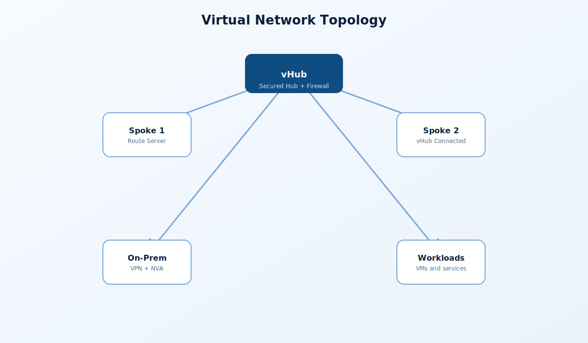

# Azure Landing Zone Lab

A cost-conscious Terraform lab for learning Azure landing-zone architecture:
hub-and-spoke networking, identity, management, governance, security, private
connectivity, monitoring, policy, and workload services.

> This is a hardened learning environment, not a production-ready landing
> zone. The `prod` profile demonstrates production-like controls while keeping
> lab-sized SKUs and disposable-resource behavior.



## What is included

- Hub-and-spoke VNets, peerings, routing, VPN options, Firewall, WAF, NAT, and
  VNet flow logs.
- Identity, jumpbox, shared services, Key Vault, Storage, SQL, AKS, and optional
  PaaS workload modules.
- Azure Policy, management groups, cost budgets, regulatory initiatives, RBAC,
  monitoring, backup, workbooks, and scheduled VM start/stop.
- Four profiles: `cheap-lab`, `lab`, `dev`, and `prod` (production-like lab).
- OIDC-only GitHub Actions with blocking Terraform, lint, policy, security,
  documentation, and Go checks.

The generated [Terraform reference](TERRAFORM.md) is the canonical list of root
inputs and outputs. Each directory under `modules/` and `landing-zones/` also
contains a generated module reference.

## Prerequisites

- Terraform 1.15.8
- Azure CLI and an Azure subscription you are allowed to use
- PowerShell 7 for repository helper scripts
- Optional local checks: TFLint 0.63.1, Trivy 0.72.0, Checkov, Gitleaks,
  actionlint 1.7.12, pre-commit, Go, and terraform-docs 0.24.0

Confirm the subscription before any plan against remote state:

```powershell
az login
az account show --output table
terraform version
```

## Secure quick start

1. Start with the cheapest profile and review its feature flags.

   ```powershell
   Copy-Item environments/cheap-lab.tfvars terraform.tfvars
   ```

2. Keep passwords and VPN keys out of files and shell history. Generate them
   for the current session or allow Terraform to generate them:

   ```powershell
   $env:TF_VAR_admin_password = '<generated-password>'
   $env:TF_VAR_sql_admin_password = '<generated-password>'
   $env:TF_VAR_vpn_shared_key = '<generated-shared-key>'
   ```

3. Run local checks without touching Azure resources:

   ```powershell
   terraform init -backend=false -lockfile=readonly
   terraform fmt -check -recursive
   terraform validate
   terraform test
   tflint --init
   tflint --recursive
   trivy config --severity MEDIUM,HIGH,CRITICAL --ignorefile .trivyignore.yaml .
   ```

4. For a real deployment, configure the protected state backend and GitHub
   OIDC environments in the [pipeline setup guide](.github/SETUP.md). Run a
   manual `plan` first. Apply and destroy are never triggered by pull requests
   or ordinary pushes.

## Cost and safety

Azure Firewall, VPN Gateway, Application Gateway WAF, NAT Gateway, AKS, public
IPs, Log Analytics ingestion, and retained flow logs can create meaningful
charges. Begin with `cheap-lab`, inspect the saved plan and cost estimate, and
destroy disposable resources when finished.

The lab intentionally keeps several teardown-friendly or low-cost defaults,
including optional purge protection, short flow-log retention, and basic SKUs.
Accepted findings and compensating controls are recorded in
[SECURITY_EXCEPTIONS.md](SECURITY_EXCEPTIONS.md). Do not copy these exceptions
into production without a separate risk review.

## Automation model

- Pull requests receive no Azure OIDC token. They run formatting, validation,
  Terraform tests, TFLint, Trivy, Checkov, Gitleaks, Conftest fixtures,
  documentation drift, actionlint, and Go tests.
- Pushes to protected `main` may create a read-only saved plan for `lab`.
- `apply` requires a manual workflow dispatch and the selected GitHub
  environment.
- `destroy` additionally requires the exact text `DESTROY <environment>` and a
  protected destroy environment.
- The state account uses Microsoft Entra authentication, versioning, soft
  delete, and a delete lock; no storage account key is required by CI.

## Documentation

- [Documentation home](wiki/README.md)
- [Architecture](wiki/architecture/overview.md)
- [Landing zones](wiki/landing-zones/README.md)
- [Module guide](wiki/modules/README.md)
- [Testing guide](wiki/testing/lab-testing-guide.md)
- [Live provisioning validation](wiki/testing/live-provisioning-validation.md)
- [State and secrets](wiki/reference/state-and-secrets.md)
- [Pipeline reference](wiki/reference/pipeline.md)
- [Contributing](CONTRIBUTING.md)
- [Security policy](SECURITY.md)

## License and responsibility

Use the lab only in subscriptions where you have authorization. Review Azure
costs and organizational policy before deploying. You remain responsible for
resources, data, access, and charges created by your runs.
