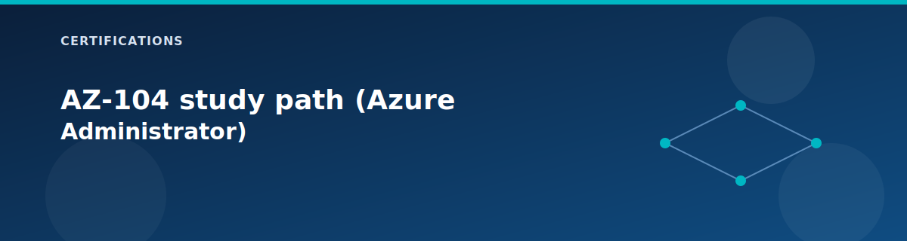

# AZ-104 study path (Azure Administrator)

<p align="center">
  
</p>


This guide maps the lab to the Azure Administrator skill areas and provides hands-on tasks you can run with this repo. It assumes you start from the current lab profile, then apply the deltas below.

## Skill map

| Domain | How the lab covers it | Key files |
| --- | --- | --- |
| Manage identities and governance | management groups, policy assignments, RBAC roles, tags | `landing-zones/governance`, `modules/management-groups`, `modules/policy`, `modules/rbac`, `policies/` |
| Implement and manage storage | storage account, private endpoints, diagnostics, access controls | `modules/storage`, `landing-zones/security/shared-services`, `wiki/reference/state-and-secrets.md` |
| Deploy and manage compute resources | jumpbox, domain controllers, workload VMs, sizing and scale | `modules/compute`, `landing-zones/identity-management`, `landing-zones/management`, `landing-zones/workload` |
| Configure and manage virtual networking | hub-spoke VNets, peering, firewall, NAT, VPN, app gateway, NSGs | `landing-zones/networking`, `modules/networking/*` |
| Monitor and back up resources | Log Analytics, diagnostic settings, alerts, backup vault | `modules/monitoring`, `modules/backup`, `wiki/reference/hardening.md` |

## Recommended profile (deltas from current lab profile)

Use the current lab configuration as a baseline, then apply these changes:

```hcl
deploy_backup            = true
deploy_vpn_gateway       = true
deploy_onprem_simulation = true
deploy_secondary_dc      = true
enable_vnet_flow_logs    = true
enable_traffic_analytics = true
```

If you need to lower cost, keep `deploy_vpn_gateway` and `deploy_onprem_simulation` off and use the rest.

## Domain 1: Manage identities and governance

Focus areas: management groups, policy assignment, RBAC, tags.

Hands-on tasks:
1. Review the management group hierarchy and policy assignments in `modules/management-groups` and `modules/policy`.
2. Add a new required tag in `policy_required_tags` and run a plan to see the compliance impact.
3. Inspect custom RBAC roles in `modules/rbac` and verify which scopes they apply to.
4. Update `owner` and `project` tags in `terraform.tfvars` and confirm they propagate across resources.

Validation checklist:
- Management groups appear in the portal with the expected hierarchy.
- Policy assignments show compliant and noncompliant resources.
- Tags are visible on hub/spoke resources.

## Domain 2: Implement and manage storage

Focus areas: storage account configuration, access controls, private endpoints, monitoring.

Hands-on tasks:
1. Confirm `deploy_storage = true` and `deploy_private_endpoints = true`.
2. Verify the Storage Account private endpoint in the shared services VNet.
3. Enable diagnostics to Log Analytics (already wired when `deploy_log_analytics = true`).
4. Review storage outputs in `outputs.tf` and use them to locate the account in Azure.

Validation checklist:
- Storage account has private endpoint and private DNS integration.
- Diagnostics from Storage are flowing to Log Analytics.

## Domain 3: Deploy and manage compute resources

Focus areas: virtual machines, sizing, availability, automation.

Hands-on tasks:
1. Change `lb_web_server_count` from 2 to 1 or 3 and run `terraform plan`.
2. Adjust `vm_size` or `lb_web_server_size` to simulate right-sizing.
3. Validate jumpbox access and confirm auto-shutdown is configured.

Validation checklist:
- Load balancer shows the expected number of backend VMs.
- Jumpbox RDP access works using `terraform output -raw jumpbox_public_ip`.

## Domain 4: Configure and manage virtual networking

Focus areas: VNets, subnets, peering, firewall, routing, VPN.

Hands-on tasks:
1. Inspect hub and spoke VNets and confirm peering links are created.
2. Toggle `deploy_firewall` and compare the routing path with and without a firewall.
3. Enable VPN and on-prem simulation to validate hybrid routing.
4. Review NSG and ASG rules in `modules/networking/nsg` and `modules/networking/asg`.

Validation checklist:
- Peering connections are established with Connected status.
- Firewall or NAT egress path matches the configuration.

## Domain 5: Monitor and back up resources

Focus areas: Log Analytics, diagnostics, alerts, backup.

Hands-on tasks:
1. Set `deploy_backup = true` and plan/apply to create the Recovery Services Vault.
2. Review diagnostics and retention in Log Analytics (`log_retention_days`, `log_daily_quota_gb`).
3. Enable flow logs and traffic analytics to study network flows.

Validation checklist:
- Log Analytics workspace shows diagnostics from key resources.
- Backup vault exists with policies ready for VM protection.

## AZ-104 checkpoint list

- I can explain how the hub-spoke network is built and how peering routes traffic.
- I can locate and interpret policy assignments and compliance results.
- I can scale compute and interpret outputs for access.
- I can validate private endpoints and DNS for storage and SQL.
- I can find monitoring signals in Log Analytics and explain backup posture.

## Cross-links

- Governance landing zone: `../landing-zones/governance.md`
- Networking landing zone: `../landing-zones/hub.md`
- Reference variables: `../reference/variables.md`
- Lab testing guide: `../testing/lab-testing-guide.md`

## Related pages

- [Certification lab workbook](lab-workbook.md)
- [Identity landing zone (Pillar 2: Identity Management)](../landing-zones/identity.md)
- [Management landing zone (Pillar 5: Management)](../landing-zones/management.md)
