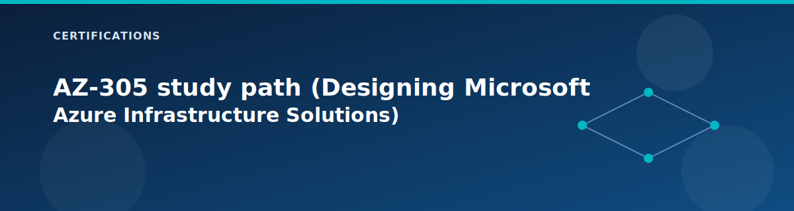

# AZ-305 study path (Designing Microsoft Azure Infrastructure Solutions)

<p align="center">
  
</p>


This guide treats the lab as a reference architecture and focuses on design choices, tradeoffs, and documentation. Use it to practice the same conversations and diagrams you would produce for an architecture review.

## Design domain map

| Design area | How the lab covers it | Key files |
| --- | --- | --- |
| Identity and governance | management groups, RBAC roles, policy, compliance mode | `landing-zones/governance`, `modules/management-groups`, `modules/rbac`, `modules/policy`, `policies/` |
| Networking and connectivity | hub-spoke, firewall, VPN, peering, NAT, App Gateway | `landing-zones/networking`, `modules/networking/*` |
| Compute and app platform | VMs, load balancer, AKS, App Service, Functions, Logic Apps | `landing-zones/workload`, `modules/compute`, `modules/aks`, `modules/app-service`, `modules/functions` |
| Data and storage | Storage, SQL, Cosmos DB, private endpoints | `landing-zones/security/shared-services`, `modules/storage`, `modules/sql`, `modules/cosmos-db` |
| Security and compliance | firewall, NSGs, private endpoints, Key Vault, compliance policies | `landing-zones/security`, `modules/firewall`, `modules/keyvault`, `modules/regulatory-compliance` |
| Monitoring and operations | Log Analytics, diagnostics, alerts, workbooks | `landing-zones/management`, `modules/monitoring/*` |

## Recommended profile (deltas from current lab profile)

Use the current lab configuration as a baseline, then apply these changes:

```hcl
deploy_vpn_gateway       = true
deploy_onprem_simulation = true
deploy_secondary_dc      = true
deploy_backup            = true
enable_vnet_flow_logs    = true
enable_traffic_analytics = true
compliance_enforcement_mode = "Default"
```

If you need to control cost, keep `deploy_onprem_simulation` off and treat it as a design exercise rather than a build.

## Architecture decision points in this repo

- Hub-spoke topology vs. flat VNet: this repo assumes hub-spoke to centralize security and routing.
- Firewall vs. NAT Gateway: firewall adds centralized inspection; NAT provides low-cost deterministic egress.
- Private endpoints vs. service endpoints: private endpoints improve isolation but add DNS complexity.
- Public jumpbox vs. VPN-only access: public IP is fast to learn; VPN is closer to enterprise posture.
- Policy audit vs. enforce: `compliance_enforcement_mode` lets you test governance without blocking deployments.
- Single-region vs. multi-region: current default is single region with optional secondary components.

## Scenario design labs

### Scenario 1: Regulated workload
Objective: design a platform that passes strict governance and data boundaries.

- Set `compliance_enforcement_mode = "Default"` and confirm policy assignments.
- Keep `deploy_private_endpoints = true` and `deploy_private_dns_zones = true`.
- Disable public jumpbox access and rely on VPN (`enable_jumpbox_public_ip = false`).
- Document the control plane: identity, RBAC, policy, and monitoring controls.

Deliverable: a one-page design note with security controls and traffic flow.

### Scenario 2: Hybrid connectivity
Objective: design hub-spoke with an on-premises simulation and explain routing.

- Enable `deploy_vpn_gateway = true` and `deploy_onprem_simulation = true`.
- Map route propagation and firewall placement.
- Validate the address space plan to avoid overlap.

Deliverable: diagram showing VPN gateway, tunnel, and spoke routing.

### Scenario 3: Resilient identity and operations
Objective: design for higher availability without overbuilding.

- Enable `deploy_secondary_dc = true` and review DNS settings.
- Add backup (`deploy_backup = true`) and describe RPO/RTO goals.
- Justify retention settings in Log Analytics.

Deliverable: short decision log covering availability and recovery.

### Scenario 4: Cost-optimized dev/test
Objective: design a low-cost landing zone while keeping core governance.

- Disable `deploy_firewall`, `deploy_application_gateway`, and PaaS flags you do not need.
- Keep management groups and policies on for governance.
- Use smaller VM sizes and fewer workload instances.

Deliverable: cost-sensitive configuration diff and rationale.

### Scenario 5: PaaS-heavy application platform
Objective: design a platform with strong PaaS coverage and private access.

- Enable Functions, App Service, Event Grid, Service Bus, Cosmos DB as needed.
- Keep private endpoints and private DNS on.
- Use `paas_alternative_location` to avoid quota blockers.

Deliverable: service map showing data flows and security boundaries.

## Artifacts to produce

- Architecture diagram (hub/spoke, security boundaries, data flows).
- Configuration diff showing which flags changed for the design.
- Risk and tradeoff table (cost vs. security vs. complexity).
- Summary of monitoring and backup posture.

## Cross-links

- Architecture overview: `../architecture/overview.md`
- Network topology: `../architecture/network-topology.md`
- Security model: `../architecture/security-model.md`
- Hardening checklist: `../reference/hardening.md`
- Configuration flow: `../architecture/configuration-flow.md`

## Related pages

- [Certification lab workbook](lab-workbook.md)
- [Hub landing zone (Pillar 1: Networking)](../landing-zones/hub.md)
- [Security landing zone (Pillar 4: Security / Shared Services)](../landing-zones/shared-services.md)
