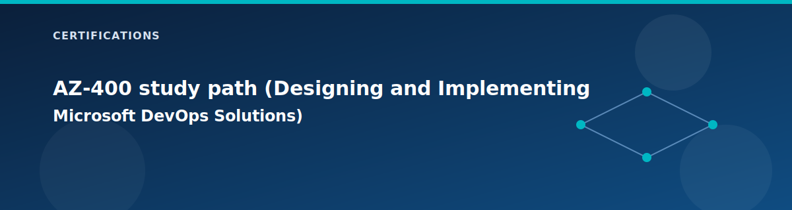

# AZ-400 study path (Designing and Implementing Microsoft DevOps Solutions)

  

This guide uses the lab repository as a DevOps playground. The GitHub Actions workflow, composite actions, policy checks, and security scanners are already wired so you can practice CI/CD, IaC, and governance in one place.

## DevOps coverage map

| Skill area | How the lab covers it | Key files |
| --- | --- | --- |
| Source control strategy | repo structure, environment tfvars, feature flags | `environments/`, `terraform.tfvars`, `main.tf` |
| CI pipeline | format, validate, security, lint, docs, graph, cost | `.github/workflows/terraform.yml` |
| CD and release | manual apply/destroy with guard rails | `.github/actions/apply`, `.github/actions/destroy` |
| Security and compliance | tfsec, checkov, gitleaks, conftest | `.github/actions/security`, `.github/actions/secret-scan`, `policies/` |
| IaC practices | modules, locals, consistent naming, outputs | `modules/`, `locals.tf`, `outputs.tf` |
| Monitoring and feedback | metrics, inventory, changelog artifacts | `.github/actions/metrics`, `.github/actions/resource-inventory`, `.github/actions/changelog` |

## Recommended profile

No configuration changes are required to practice the pipeline. Keep the current lab profile and focus on workflow changes in `.github/workflows/terraform.yml` and `.github/actions/`.

## Hands-on path by skill area

### 1. Source control and collaboration
- Create a branch, change a single flag in `terraform.tfvars`, and open a PR.
- Review the plan output and verify that apply is still manual.
- Practice small, reviewable commits with clear intent.

### 2. Continuous integration
- Run the workflow on a PR and review the format, validate, and security jobs.
- Confirm that `terraform-docs` and graph artifacts are uploaded.
- Review SARIF outputs for tfsec and Checkov.

### 3. Infrastructure as code quality
- Add or update a module input and validate that `terraform validate` and TFLint still pass.
- Update tags in `locals.tf` and verify resource changes in the plan.

### 4. Security and compliance
- Add a new Conftest policy in `policies/` and confirm it runs in the pipeline.
- Trigger the Gitleaks scan by adding a test secret in a branch, then remove it.
- Decide which checks should be soft-fail vs. hard-fail for your target environment.

### 5. Release management
- Use `workflow_dispatch` with `action=plan` and `action=apply` for a controlled deployment.
- Practice using the destroy confirmation gate and state backup.
- Document what approvals you would require in a production environment.

### 6. Observability and feedback
- Download the `resource-inventory` artifact and review state coverage.
- Inspect the `metrics` artifact to understand deploy duration and change counts.
- Capture cost output from the Infracost job if you set `INFRACOST_API_KEY`.

## Pipeline enhancement exercises

- Add an environment protection rule in GitHub (manual approval on apply).
- Wire the Terratest composite action as a separate job after plan or apply.
- Add a scheduled workflow for nightly plan to detect drift.
- Post plan summaries to PRs for faster review feedback.

## Evidence to collect

- Workflow run summaries and artifact links.
- SARIF security scan outputs.
- Terraform plan and apply logs.
- Notes on how you would gate production changes.

## Cross-links

- Pipeline overview: `../reference/pipeline.md`
- Pipeline templates: `../reference/pipeline-templates.md`
- State and secrets: `../reference/state-and-secrets.md`
- Book-style guide: `../book.md`

## Related pages

- [Certification lab workbook](lab-workbook.md)
- [Module design patterns](../modules/README.md)
