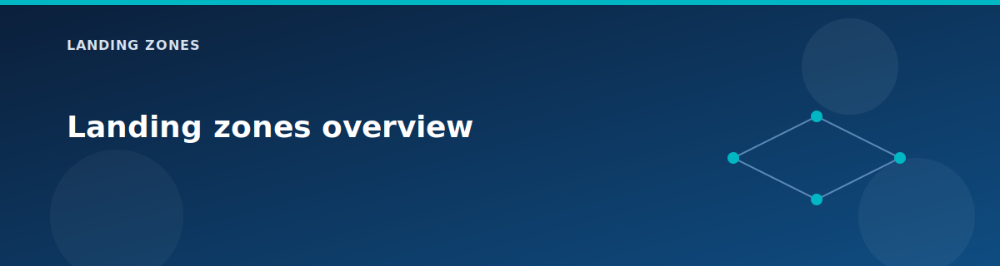

# Landing zones overview

<p align="center">
  
</p>


In this lab, the platform follows a **5-pillar architecture** aligned with Microsoft's Cloud Adoption Framework. Each pillar is a self-contained Terraform module that owns one part of the platform. The root module orchestrates them in sequence, passing shared context (tags, location, environment) and cross-pillar references (firewall IP, DNS servers).

## What you will learn

- The 5-pillar structure and what each pillar is responsible for.  
- Which components are optional and how they depend on one another.  
- How outputs from one pillar become inputs to the next.

## The 5-pillar architecture at a glance

| Pillar | Folder | Purpose | Key Components |
|--------|--------|---------|----------------|
| **1. Networking** | `landing-zones/networking/` | Central connectivity and inspection | Hub VNet, Azure Firewall, VPN Gateway, App Gateway, Peering, NAT Gateway |
| **2. Identity Management** | `landing-zones/identity-management/` | Directory and DNS for the platform | Domain Controllers (DC01, DC02), DNS servers, Identity VNet |
| **3. Governance** | `landing-zones/governance/` | Policy, compliance, and cost control | Management Groups, Azure Policy, Cost Management, RBAC, Regulatory Compliance |
| **4. Security** | `landing-zones/security/` | Shared services and secrets | Key Vault, Storage Account, SQL Database, Private DNS Zones, Private Endpoints |
| **5. Management** | `landing-zones/management/` | Operations, monitoring, and workloads | Jumpbox VM, Log Analytics, Alerts, Backup, Automation, Workload zones (Prod/Dev) |

## How the pillars connect

```
┌─────────────────────────────────────────────────────────────────────────────┐
│                           PILLAR DEPENDENCY FLOW                             │
├─────────────────────────────────────────────────────────────────────────────┤
│                                                                              │
│  ┌──────────────┐    firewall_ip    ┌──────────────┐                        │
│  │  NETWORKING  │ ─────────────────►│   IDENTITY   │                        │
│  │  (Pillar 1)  │                   │  (Pillar 2)  │                        │
│  └──────┬───────┘                   └──────┬───────┘                        │
│         │                                  │ dns_servers                    │
│         │ vnet_id, firewall_ip             │                                │
│         ▼                                  ▼                                │
│  ┌──────────────┐    dns_servers    ┌──────────────┐                        │
│  │  MANAGEMENT  │ ◄─────────────────│   SECURITY   │                        │
│  │  (Pillar 5)  │                   │  (Pillar 4)  │                        │
│  └──────┬───────┘                   └──────────────┘                        │
│         │ log_analytics_id                                                  │
│         ▼                                                                   │
│  ┌──────────────┐                                                           │
│  │  GOVERNANCE  │  ◄── runs last (needs subscription context)               │
│  │  (Pillar 3)  │                                                           │
│  └──────────────┘                                                           │
│                                                                              │
└─────────────────────────────────────────────────────────────────────────────┘
```

- **Networking** exports the hub VNet ID, firewall private IP, VPN gateway ID, and Application Gateway details.
- **Identity** exports DNS server IPs; every other pillar consumes them for consistent name resolution.
- **Management** exports the Log Analytics workspace ID; AKS, Application Gateway, and diagnostics use it.
- **Security** creates the shared services VNet with Key Vault, Storage, and optional Private Endpoints.
- **Governance** runs last and applies policies, management groups, cost budgets, and RBAC roles.

## What each pillar contains

### Pillar 1: Networking (`landing-zones/networking/`)
- **core/**: Hub VNet, Azure Firewall, VPN Gateway, Application Gateway
- **connectivity/**: VNet peering, VNet flow logs, NAT Gateway, Application Security Groups
- **onprem-simulated/**: Simulated on-premises for VPN testing
- **Firewall Rules**: Base rules + PaaS rules attached via modules

### Pillar 2: Identity Management (`landing-zones/identity-management/`)
- **core/**: Identity VNet, DC subnet, Domain Controller VMs
- Exports DNS servers used by all other spokes
- Optional secondary DC for high availability

### Pillar 3: Governance (`landing-zones/governance/`)
- Management Groups hierarchy (Platform, Landing Zones, Sandbox, Decommissioned)
- Azure Policy assignments (locations, tags, HTTPS storage, NSG requirements)
- Cost Management (monthly budget, anomaly alerts)
- RBAC custom roles (Network Operator, Backup Operator, Monitoring Reader)
- Regulatory Compliance (HIPAA, PCI-DSS in audit mode)

### Pillar 4: Security (`landing-zones/security/`)
- **shared-services/**: Shared VNet, Key Vault, Storage Account
- Private DNS Zones for Private Link (blob, keyvault, SQL)
- Private Endpoints for PaaS services
- SQL Database with optional private connectivity

### Pillar 5: Management (`landing-zones/management/`)
- **core/**: Management VNet, Jumpbox VM, Log Analytics workspace
- **workload/**: Workload zones (prod/dev) with web/app/data subnets
- Monitoring: Action groups, alerts, diagnostic settings, workbooks
- Backup: Recovery Services Vault (optional)
- Automation: Start/Stop schedules for VMs
- PaaS in workloads: Functions, App Service, Logic Apps, Event Grid, Service Bus, Cosmos DB

## Choosing what to deploy

Use the **Master Control Panel** in `terraform.tfvars` to toggle components:

| Category | Flags | Impact |
|----------|-------|--------|
| **Core** | `deploy_firewall`, `deploy_vpn_gateway`, `deploy_application_gateway` | Cost-heavy; disable for minimal demos |
| **Identity** | `deploy_secondary_dc` | Add HA for domain services |
| **Workloads** | `deploy_workload_prod`, `deploy_workload_dev` | Enable one or both environments |
| **PaaS** | `deploy_functions`, `deploy_app_service`, `deploy_cosmos_db`, etc. | All optional, most free tier |
| **Network Add-ons** | `deploy_nat_gateway`, `deploy_private_endpoints`, `enable_vnet_flow_logs` | Enhanced networking features |
| **Governance** | `deploy_azure_policy`, `deploy_management_groups`, `deploy_cost_management` | Policy and compliance controls |

## Next steps

Start with **Networking** to understand the hub-spoke topology, then follow the pillar chain:
1. [Hub/Networking](hub.md) – Central connectivity
2. [Identity](identity.md) – Domain controllers and DNS
3. [Management](management.md) – Jumpbox and monitoring
4. [Shared Services/Security](shared-services.md) – Key Vault, storage, SQL
5. [Workload](workload.md) – Application tiers and PaaS
6. [On-premises simulated](onprem-simulated.md) – Hybrid testing

## Related pages

- [Architecture overview](../architecture/overview.md)
- [Network topology](../architecture/network-topology.md)
- [Module design patterns](../modules/README.md)
- [Variables reference](../reference/variables.md)
