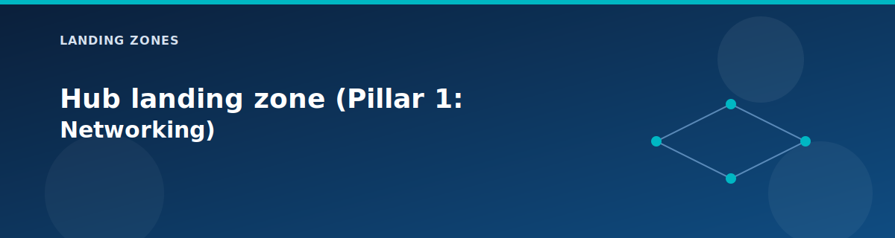

# Hub landing zone (Pillar 1: Networking)

  

The hub is the centre of the network and represents **Pillar 1** of the 5-pillar Azure Landing Zone architecture. It hosts the firewall, optional VPN gateway, NAT Gateway, and optional Application Gateway. Every spoke VNet peers back here, and most traffic passes through it for inspection.

## What you will learn

- What the hub deploys and why it is the first landing zone pillar.  
- Which switches control costly components like the firewall and VPN gateway.  
- What the hub exports to the rest of the platform.

## What it deploys

| Component | Default | Purpose |
|-----------|---------|---------|
| Hub VNet | `10.0.0.0/16` | Central network connectivity |
| Azure Firewall | Standard | Centralized traffic inspection |
| Firewall Policy | Created | Rule collections for east-west and north-south |
| VPN Gateway (optional) | Off | Hybrid connectivity to on-premises |
| Application Gateway | WAF_v2 | Layer 7 ingress with Web Application Firewall |
| NAT Gateway | On | Fixed outbound IP for workloads |
| Route Tables | Created | Traffic steering through firewall |

### Subnet layout

| Subnet | CIDR | Purpose |
|--------|------|---------|
| GatewaySubnet | `10.0.0.0/24` | VPN Gateway |
| AzureFirewallSubnet | `10.0.1.0/24` | Azure Firewall |
| HubManagementSubnet | `10.0.2.0/24` | Hub-level management |
| AppGatewaySubnet | `10.0.3.0/24` | Application Gateway |

## Inputs to know about

| Variable | Description | Default |
|----------|-------------|---------|
| `deploy_firewall` | Enable Azure Firewall | `true` |
| `firewall_sku_tier` | Firewall SKU (Standard/Premium) | `Standard` |
| `deploy_vpn_gateway` | Enable VPN Gateway | `false` |
| `vpn_gateway_sku` | VPN Gateway SKU | `VpnGw1` |
| `enable_bgp` | Enable BGP routing | `false` |
| `deploy_application_gateway` | Enable Application Gateway with WAF | `true` |
| `appgw_waf_mode` | WAF mode (Detection/Prevention) | `Detection` |
| `deploy_nat_gateway` | Enable NAT Gateway | `true` |

## Observability features

| Variable | Description | Default |
|----------|-------------|---------|
| `enable_vnet_flow_logs` | Capture VNet traffic to storage | `true` |
| `enable_traffic_analytics` | Ship flow logs to Log Analytics | `true` |
| `create_network_watcher` | Create Network Watcher if missing | `true` |
| `deploy_private_dns_zones` | Central Private DNS zones | `true` |

## Outputs other zones consume

| Output | Description | Used By |
|--------|-------------|---------|
| `firewall_private_ip` | Next hop for spoke route tables | All spokes |
| `firewall_public_ip` | Egress IP for outbound traffic | Diagnostics |
| `vpn_gateway_public_ip` | VPN endpoint | On-premises |
| `application_gateway_id` | App Gateway resource ID | Workloads |
| `nat_gateway_public_ip` | Fixed outbound IP | Workloads |

## How it behaves

- Subnets are created in a safe order (gateway → firewall → management) to avoid Azure control-plane race conditions.  
- NSG attachment to the management subnet waits until the VPN gateway is ready.  
- Application Gateway backend IPs are injected after deployment to avoid circular dependencies.  
- Gateway transit is enabled in peering when the VPN gateway is on so spokes can reach on-premises networks.

## Cost and lab tips

| Component | Estimated Cost | Optimization |
|-----------|----------------|--------------|
| Azure Firewall | ~$300/month | Set `deploy_firewall = false` for topology-only labs |
| VPN Gateway | ~$140/month | Keep `deploy_vpn_gateway = false` for most labs |
| Application Gateway | ~$36/month | Use Detection mode; Prevention is same cost |
| NAT Gateway | ~$45/month | Disable if not needed for fixed outbound IP |

## Next step

Move to the [identity landing zone](identity.md) (Pillar 2) to add DNS and Active Directory for the platform.

## Related pages

- [Network topology](../architecture/network-topology.md)
- [Networking modules](../modules/networking.md)
- [Variables reference](../reference/variables.md)
