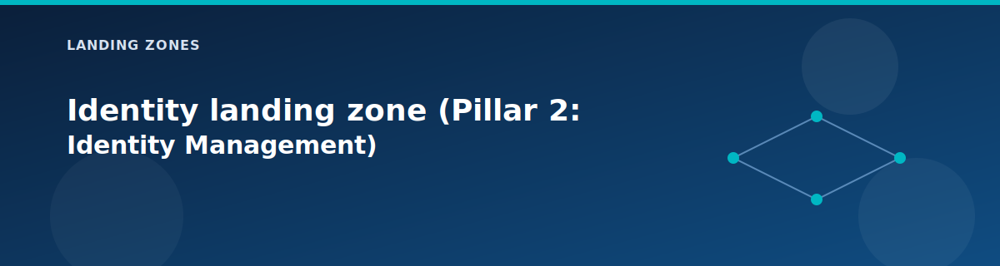

# Identity landing zone (Pillar 2: Identity Management)

  

The identity landing zone provides DNS and Active Directory for the entire lab and represents Pillar 2 of the 5-pillar Azure Landing Zone architecture. Other zones point to these domain controllers for name resolution so services can find each other by name instead of IP.

This pillar complements Microsoft Entra. Entra handles Azure access and RBAC, while these AD DS VMs provide a traditional Windows domain for workloads that expect it.

## What you will learn

- What the identity zone deploys and how it fits into the hub-and-spoke layout.
- How Entra and AD DS split responsibilities in this lab.
- Which settings control the number of domain controllers and their IPs.
- What outputs other zones need from identity.

## Identity boundaries in this lab

- Microsoft Entra ID is the identity control plane for Azure access and Terraform automation.
- Active Directory Domain Services (AD DS) in the identity VNet provides Windows domain join and DNS for workloads.
- VNets use the AD DS IPs as custom DNS so name resolution is consistent across spokes.

## What it deploys

| Component | Default | Purpose |
|-----------|---------|---------|
| Identity VNet | `10.1.0.0/16` | Isolated network for identity services |
| DC01 | Static IP `10.1.1.4` | Primary Domain Controller |
| DC02 (optional) | Static IP `10.1.1.5` | Secondary DC for HA |
| NSG | Created | Active Directory ports + RDP access |
| Route Table | Created | Traffic steering through firewall |

### Subnet layout

| Subnet | CIDR | Purpose |
|--------|------|---------|
| DC Subnet | `10.1.1.0/24` | Domain Controllers |

## Inputs to know about

| Variable | Description | Default |
|----------|-------------|---------|
| `identity_address_space` | Identity VNet CIDR | `10.1.0.0/16` |
| `identity_dc_subnet_prefix` | DC subnet CIDR | `10.1.1.0/24` |
| `dc01_ip_address` | DC01 static IP | `10.1.1.4` |
| `dc02_ip_address` | DC02 static IP | `10.1.1.5` |
| `deploy_secondary_dc` | Enable DC02 for HA | `false` |
| `enable_auto_shutdown` | Cost-saving VM shutdown | `true` |

## Outputs other zones consume

| Output | Description | Used By |
|--------|-------------|---------|
| `dns_servers` | List of DC private IPs | All spoke VNets |
| `vnet_id` | Identity VNet resource ID | Peering module |
| `dc01_vm_id` | DC01 VM resource ID | Diagnostics/backup |

## How it behaves

- DNS IPs are exported so every other landing zone can simply reuse them; you do not have to hard-code DNS anywhere else.
- NSG rules scope inbound RDP and directory traffic to the hub or on-premises prefixes, reducing exposure.
- When the firewall is enabled, the route table pushes outbound traffic back to the hub for inspection.
- VNet peering to the hub is created with DNS forwarding enabled.

## Operational notes

- Patch and reboot the DCs like any other Windows Server VM.
- Rotate admin passwords in `terraform.tfvars` if you rebuild or share the lab.
- Consider enabling backup for DCs in longer-lived environments.
- Keep time synchronization healthy; AD DS is sensitive to clock drift.

## Common pitfalls

- Incorrect DNS settings in spoke VNets cause domain join and name resolution failures.
- Blocking ports between spokes and the identity VNet prevents AD DS traffic.
- Turning on the firewall without updating routes can strand traffic from the DCs.

## When to add the secondary DC

| Scenario | Recommendation |
|----------|----------------|
| Cost-optimized lab | Keep `deploy_secondary_dc = false` |
| Production simulation | Enable `deploy_secondary_dc = true` |
| Maintenance testing | Enable DC02 to test failover |

## Cost and lab tips

| Component | Estimated Cost | Optimization |
|-----------|----------------|--------------|
| DC01 (Standard_B2s) | ~$30/month | Auto-shutdown enabled |
| DC02 (optional) | ~$30/month | Disable for cost savings |

## Next step

Proceed to the [governance landing zone](governance.md) (Pillar 3) to configure management groups, policies, and cost management.

## Related pages

- [Compute modules](../modules/compute.md)
- [Architecture overview](../architecture/overview.md)
- [Variables reference](../reference/variables.md)
- [Management landing zone (Pillar 5: Management)](management.md)
