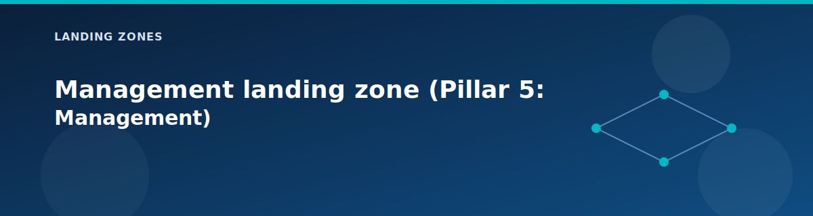

# Management landing zone (Pillar 5: Management)

  

The management landing zone gives administrators a safe entry point and a place to collect logs. It represents **Pillar 5** of the 5-pillar Azure Landing Zone architecture and hosts the jumpbox VM, Log Analytics workspace, backup, automation, and monitoring that many other services rely on.

## What you will learn

- What the management zone deploys and how it connects to the rest of the platform.  
- How to control public access, shutdown schedules, and logging costs.  
- What outputs other zones expect from management.

## What it deploys

| Component | Default | Purpose |
|-----------|---------|---------|
| Management VNet | `10.2.0.0/16` | Isolated management network |
| Jumpbox VM | Windows Server | Administrator entry point |
| Log Analytics | 30-day retention | Centralized logging |
| Recovery Services Vault | LRS | VM backup |
| Action Group | Created | Alert notifications |
| Azure Workbooks | Created | Monitoring dashboards |
| Connection Monitor | Created | Network connectivity testing |
| Automation Account | Created | Scheduled start/stop |

### Subnet layout

| Subnet | CIDR | Purpose |
|--------|------|---------|
| Jumpbox Subnet | `10.2.1.0/24` | Management jumpbox |

## Inputs to know about

| Variable | Description | Default |
|----------|-------------|---------|
| `enable_jumpbox_public_ip` | Public IP for jumpbox | `false` |
| `allowed_jumpbox_source_ips` | IPs allowed to RDP | `[]` |
| `deploy_log_analytics` | Enable Log Analytics | `true` |
| `log_retention_days` | Log retention period | `30` |
| `log_daily_quota_gb` | Daily ingestion limit | `1` |
| `deploy_backup` | Enable Recovery Services | `true` |
| `backup_storage_redundancy` | Backup redundancy | `LocallyRedundant` |
| `deploy_workbooks` | Enable Azure Workbooks | `true` |
| `deploy_connection_monitor` | Enable Connection Monitor | `true` |
| `enable_scheduled_startstop` | VM automation | `true` |
| `startstop_timezone` | Schedule timezone | `America/New_York` |

## Outputs other zones consume

| Output | Description | Used By |
|--------|-------------|---------|
| `jumpbox_private_ip` | Jumpbox private IP | Administrators |
| `jumpbox_public_ip` | Jumpbox public IP (if enabled) | Administrators |
| `log_analytics_workspace_id` | Workspace ID | All diagnostics |
| `recovery_services_vault_id` | Vault ID | VM backup policies |
| `action_group_id` | Alert action group | All alerts |

## How it behaves

- NSG rules allow RDP only from the VPN client pool and hub address space by default; you can extend the allowlist.  
- Auto-shutdown is enabled by default to keep lab costs low.  
- Diagnostic settings for other resources point to this workspace.
- Scheduled start/stop uses Azure Automation runbooks with Logic Apps for triggering.

## Workload management

The management zone also supports workload-level management through:
- **workload/** submodule for workload-specific monitoring
- Connection monitors between spokes and hub
- Azure Workbooks for network and security visualization

## When to enable the public IP

| Scenario | Recommendation |
|----------|----------------|
| Quick demo | Enable with restricted IPs |
| Production-like | Keep off, use VPN |
| Testing | Enable temporarily |

## Cost and lab tips

| Component | Estimated Cost | Optimization |
|-----------|----------------|--------------|
| Jumpbox VM | ~$30/month | Auto-shutdown enabled |
| Log Analytics | ~$10/month | Set `log_daily_quota_gb = 1` |
| Recovery Services | ~$10/month | LRS for lab environments |
| Workbooks | Free | No cost |
| Connection Monitor | ~$1/month | Minimal endpoints |

## Next step

Review the [security landing zone](shared-services.md) (Pillar 4) for Key Vault, storage, SQL, and private endpoints.

## Related pages

- [Monitoring modules](../modules/monitoring.md)
- [Outputs reference](../reference/outputs.md)
- [Lab testing guide](../testing/lab-testing-guide.md)
- [Workload landing zone](workload.md)
