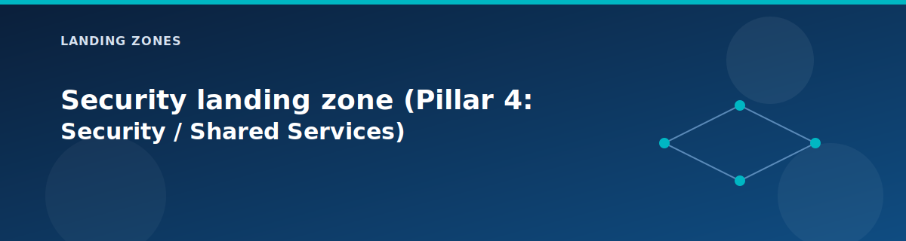

# Security landing zone (Pillar 4: Security / Shared Services)

  

The security landing zone provides common PaaS components and security services that multiple applications can use. It represents **Pillar 4** of the 5-pillar Azure Landing Zone architecture and keeps secrets, data, private endpoints, and security configurations in one place so workloads do not duplicate them.

## What you will learn

- Which shared services are available out of the box and how to toggle them.  
- How DNS and firewall settings from other zones are reused here.  
- What outputs you can hand to application teams.

## What it deploys

| Component | Default | Purpose |
|-----------|---------|---------|
| Shared Services VNet | `10.3.0.0/16` | Isolated network for shared services |
| Azure Key Vault | Enabled | Centralized secrets management |
| Storage Account | Enabled | General-purpose storage |
| Azure SQL Database | Enabled | Managed relational database |
| Private Endpoints | Enabled | Private access to PaaS |
| Private DNS Zones | Enabled | DNS resolution for Private Link |
| Application Security Groups | Optional | Micro-segmentation |

### Subnet layout

| Subnet | CIDR | Purpose |
|--------|------|---------|
| App Subnet | `10.3.1.0/24` | Application workloads |
| Private Endpoint Subnet | `10.3.2.0/24` | Private Endpoints |

## Inputs to know about

| Variable | Description | Default |
|----------|-------------|---------|
| `deploy_keyvault` | Enable Key Vault | `true` |
| `deploy_storage` | Enable Storage Account | `true` |
| `deploy_sql` | Enable Azure SQL | `true` |
| `deploy_private_dns_zones` | Enable Private DNS | `true` |
| `deploy_private_endpoints` | Enable Private Endpoints | `true` |
| `deploy_application_security_groups` | Enable ASGs | `false` |

## Private DNS zones created

When `deploy_private_dns_zones = true`:

| Zone | Service |
|------|---------|
| `privatelink.blob.core.windows.net` | Storage Blob |
| `privatelink.vaultcore.azure.net` | Key Vault |
| `privatelink.database.windows.net` | SQL Database |
| `privatelink.azurewebsites.net` | App Service |
| `privatelink.servicebus.windows.net` | Service Bus |

## Outputs other zones or teams can use

| Output | Description | Used By |
|--------|-------------|---------|
| `keyvault_uri` | Key Vault URI | Applications |
| `keyvault_name` | Key Vault name | Terraform references |
| `storage_account_name` | Storage account name | Applications |
| `sql_server_fqdn` | SQL Server FQDN | Connection strings |
| `vnet_id` | Shared VNet ID | Peering |

## How it behaves

- Uses the tenant ID from `azurerm_client_config` to create Key Vault access policies.  
- Applies the shared tag set so ownership and cost are easy to trace.  
- Keeps routing consistent with the firewall flag.
- Private Endpoints are linked to the centralized Private DNS zones.

## When to enable each service

| Service | Recommendation | Cost |
|---------|----------------|------|
| Key Vault | Always enable | ~$3/month |
| Storage | Enable for diagnostics/data | ~$5/month |
| SQL | Enable for stateful apps | ~$5/month |
| Private DNS | Enable with Private Endpoints | Minimal |
| ASGs | Enable for micro-segmentation | Free |

## Cost and lab tips

| Component | Estimated Cost | Optimization |
|-----------|----------------|--------------|
| Key Vault | ~$3/month | Standard tier is sufficient |
| Storage | ~$5/month | LRS for lab |
| Azure SQL | ~$5/month | Basic tier for lab |
| Private Endpoints | None | No hourly cost |

## Next step

Explore the [workload landing zone](workload.md) to see how an application stack consumes these shared services.

## Related pages

- [Security modules](../modules/security.md)
- [Security model](../architecture/security-model.md)
- [Remote State & Secrets Management](../reference/state-and-secrets.md)
- [Variables reference](../reference/variables.md)
