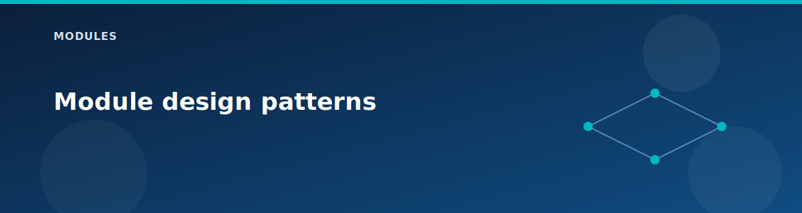

# Module design patterns

<p align="center">
  
</p>


The lab is built from small, reusable Terraform modules organized by the **5-pillar Azure Landing Zone architecture**. Each module creates a focused set of resources and expects the caller to decide names, tags, and feature flags. This page explains how the modules are structured so you can reuse or extend them in your own projects.

## Module organization by pillar

| Pillar | Module Categories | Count |
|--------|-------------------|-------|
| **1. Networking** | VNets, subnets, NSGs, route tables, peering, VPN, NAT, load balancers, App Gateway | 15 |
| **2. Identity** | Windows VMs (Domain Controllers) | 2 |
| **3. Governance** | Management groups, policies, cost management, RBAC, compliance | 5 |
| **4. Security** | Firewall, firewall rules, Key Vault, storage, SQL, private endpoints | 8 |
| **5. Management** | Log Analytics, action groups, alerts, diagnostic settings, backup, workbooks, automation | 10 |
| **Workload** | AKS, Functions, App Service, Logic Apps, Cosmos DB, Service Bus | 12 |

## How modules are structured

```
modules/
├── module-name/
│   ├── main.tf       # Resource definitions
│   ├── variables.tf  # Input variables with types and descriptions
│   └── outputs.tf    # Output values for chaining
```

- Inputs are validated with types and descriptions; required values are marked clearly.  
- Outputs return IDs, names, and IPs so callers can chain modules together.  
- Modules avoid inventing names; the caller passes fully composed names and tags.

## Conventions that keep things simple

| Convention | Description |
|------------|-------------|
| Single-purpose | One module for NSGs, another for VNets, etc. |
| Caller decides | Root or landing zone decides whether something should exist |
| Shared tags | Every resource uses caller-provided tags |
| Explicit dependencies | Use `depends_on` for Azure control-plane serialization |

## Testing a module by itself

```bash
# 1. Create a scratch main.tf pointing to the module
# 2. Supply minimal inputs
terraform init && terraform apply

# 3. Destroy when finished
terraform destroy
```

## Categories documentation

| Category | Modules | Documentation |
|----------|---------|---------------|
| **Networking** | VNets, subnets, NSGs, route tables, peering, VPN, NAT gateway, load balancers, Application Gateway | [networking.md](networking.md) |
| **Compute** | Windows VMs, IIS web servers | [compute.md](compute.md) |
| **Security** | Azure Firewall, firewall rules, Key Vault | [security.md](security.md) |
| **Monitoring** | Log Analytics, action groups, alerts, diagnostic settings, workbooks, connection monitor | [monitoring.md](monitoring.md) |
| **PaaS** | AKS, Functions, App Service, Logic Apps, Cosmos DB, Service Bus, Static Web App | [paas.md](paas.md) |
| **Governance** | Management groups, policies, cost management, RBAC, compliance | [governance.md](governance.md) |

## Module inventory

### Networking (`modules/networking/`)

| Module | Purpose |
|--------|---------|
| `vnet/` | Virtual network with custom DNS |
| `subnet/` | Subnets with service endpoints |
| `nsg/` | Network security groups |
| `route-table/` | User-defined routes |
| `peering/` | Bidirectional VNet peering |
| `vpn-gateway/` | Route-based VPN gateway |
| `vpn-connection/` | Site-to-site VPN connections |
| `local-network-gateway/` | On-premises gateway representation |
| `load-balancer/` | Standard load balancer (public/internal) |
| `nat-gateway/` | NAT Gateway for outbound IP |
| `asg/` | Application Security Groups |
| `private-dns-zone/` | Private DNS zones for Private Link |

### Compute (`modules/compute/`)

| Module | Purpose |
|--------|---------|
| `windows-vm/` | Windows Server VMs with optional public IP |
| `web-server/` | IIS web servers with load balancer integration |

### Security (`modules/`)

| Module | Purpose |
|--------|---------|
| `firewall/` | Azure Firewall with policy |
| `firewall-rules/` | Rule collection groups |
| `keyvault/` | Azure Key Vault |
| `storage/` | Storage accounts |
| `sql/` | Azure SQL Database |
| `private-endpoint/` | Private Endpoints |

### Monitoring (`modules/monitoring/`)

| Module | Purpose |
|--------|---------|
| `log-analytics/` | Log Analytics workspace |
| `action-group/` | Alert action groups |
| `alerts/` | Metric alerts |
| `diagnostic-settings/` | Diagnostic settings |
| `workbooks/` | Azure Workbooks |
| `nsg-flow-logs/` | NSG flow logs (legacy) |
| `vnet-flow-logs/` | VNet flow logs (modern) |
| `connection-monitor/` | Network connection testing |

### PaaS (`modules/`)

| Module | Purpose |
|--------|---------|
| `aks/` | Azure Kubernetes Service |
| `app-service/` | App Service (Web Apps) |
| `functions/` | Azure Functions |
| `logic-apps/` | Logic Apps |
| `cosmos-db/` | Cosmos DB (Serverless) |
| `service-bus/` | Service Bus |
| `event-grid/` | Event Grid |
| `static-web-app/` | Static Web Apps |

### Governance (`modules/`)

| Module | Purpose |
|--------|---------|
| `management-groups/` | Management Group hierarchy |
| `policy/` | Azure Policy assignments |
| `cost-management/` | Budgets and cost alerts |
| `rbac/` | Custom RBAC roles |
| `regulatory-compliance/` | HIPAA/PCI-DSS initiatives |

## Error avoidance tips

| Issue | Solution |
|-------|----------|
| Name length limits | Use `location_short` codes (wus2, eus2) |
| Global uniqueness | Use random suffix for storage, Key Vault |
| Asymmetric routing | Skip firewall UDR for public LB web subnet |
| Subnet conflicts | Add `depends_on` for sequential subnet creation |

## Related pages

- [Architecture overview](../architecture/overview.md)
- [Terraform patterns](../reference/terraform-patterns.md)
- [Landing zones overview](../landing-zones/README.md)
