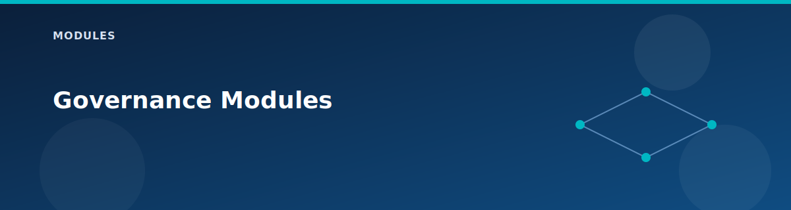

# Governance Modules

<p align="center">
  
</p>


The governance modules provide reusable building blocks for policy, compliance, cost control, and access management. They are consumed by the Governance pillar (`landing-zones/governance/`) to implement enterprise controls.

## Module inventory

| Module | Location | Purpose |
|--------|----------|---------|
| **Management Groups** | `modules/management-groups/` | Hierarchical subscription organization |
| **Policy** | `modules/policy/` | Azure Policy definitions and assignments |
| **Cost Management** | `modules/cost-management/` | Budgets, alerts, and anomaly detection |
| **RBAC** | `modules/rbac/` | Custom role definitions and assignments |
| **Regulatory Compliance** | `modules/regulatory-compliance/` | HIPAA, PCI-DSS policy initiatives |

---

## Management Groups Module

Creates a hierarchical management group structure following CAF patterns.

### Resources created

- Root management group
- Platform management group (with Identity, Management, Connectivity children)
- Landing Zones management group (with Corp, Online children)
- Sandbox management group
- Decommissioned management group
- Subscription associations

### Key inputs

| Variable | Type | Description |
|----------|------|-------------|
| `root_management_group_name` | string | Display name for root MG |
| `root_management_group_id` | string | ID for root MG (no spaces) |
| `create_platform_mg` | bool | Create platform hierarchy |
| `create_landing_zones_mg` | bool | Create landing zones hierarchy |
| `subscription_ids_*` | list | Subscriptions to assign to each MG |

### Example usage

```hcl
module "management_groups" {
  source = "../../modules/management-groups"

  root_management_group_name = "Contoso"
  root_management_group_id   = "contoso-root"
  create_platform_mg         = true
  create_landing_zones_mg    = true
  
  subscription_ids_landing_zones_corp = [var.subscription_id]
}
```

---

## Policy Module

Assigns Azure Policy definitions at the subscription or management group scope.

### Policies available

| Policy | Effect | Description |
|--------|--------|-------------|
| Allowed Locations | Deny | Restrict resource creation to approved regions |
| Required Tags | Deny | Enforce mandatory tags (Environment, Owner, Project) |
| HTTPS Storage | Deny | Require secure transfer for storage accounts |
| NSG on Subnet | Audit | Audit subnets without NSGs |
| Audit Public Access | Audit | Flag resources with public network access |
| Allowed VM SKUs | Deny | Restrict VM sizes (optional) |

### Key inputs

| Variable | Type | Description |
|----------|------|-------------|
| `scope` | string | Policy assignment scope (subscription or MG) |
| `allowed_locations` | list | Approved Azure regions |
| `required_tags` | map | Tags that must exist on all resources |
| `enable_*` | bool | Toggle each policy on/off |

### Example usage

```hcl
module "azure_policy" {
  source = "../../modules/policy"

  scope    = "/subscriptions/${var.subscription_id}"
  location = "westus2"

  enable_allowed_locations_policy = true
  allowed_locations = ["westus2", "eastus", "westeurope"]

  enable_require_tag_policy = true
  required_tags = {
    Environment = "lab"
    Owner       = "Lab-User"
    Project     = "azlab"
  }

  enable_require_https_storage = true
  enable_require_nsg_on_subnet = true
}
```

---

## Cost Management Module

Creates budgets, action groups, and cost anomaly alerts.

### Resources created

- Subscription-level budget with threshold notifications
- Action group for email alerts
- Cost anomaly alert rule

### Key inputs

| Variable | Type | Description |
|----------|------|-------------|
| `scope` | string | Budget scope (subscription) |
| `budget_amount` | number | Monthly budget in USD |
| `budget_name` | string | Name for the budget |
| `action_group_email_receivers` | list | Email addresses for alerts |
| `enable_anomaly_alert` | bool | Create cost anomaly detection |

### Budget thresholds

- 50% - Informational
- 75% - Warning
- 90% - Critical
- 100% - Over budget

### Example usage

```hcl
module "cost_management" {
  source = "../../modules/cost-management"

  scope               = "/subscriptions/${var.subscription_id}"
  resource_group_name = "rg-management-lab-wus2"
  environment         = "lab"
  location            = "westus2"

  enable_budget = true
  budget_amount = 500
  budget_name   = "monthly-budget"

  enable_action_group = true
  action_group_email_receivers = [
    { name = "admin", email_address = "admin@contoso.com" }
  ]

  enable_anomaly_alert          = true
  anomaly_alert_email_receivers = ["admin@contoso.com"]

  tags = var.tags
}
```

---

## RBAC Module

Creates custom role definitions following least-privilege principles.

### Roles available

| Role | Permissions |
|------|-------------|
| **Network Operator** | Create/modify VNets, NSGs, route tables, peerings |
| **Backup Operator** | Manage Recovery Services vaults, policies, protected items |
| **Monitoring Reader** | Read Log Analytics, metrics, alerts |

### Key inputs

| Variable | Type | Description |
|----------|------|-------------|
| `deploy_network_operator_role` | bool | Create network operator role |
| `deploy_backup_operator_role` | bool | Create backup operator role |
| `deploy_monitoring_reader_role` | bool | Create monitoring reader role |
| `*_principals` | list | Principal IDs for role assignments |

### Example usage

```hcl
module "rbac" {
  source = "../../modules/rbac"

  deploy_network_operator_role  = true
  deploy_backup_operator_role   = true
  deploy_monitoring_reader_role = true

  network_operator_principals = [
    "aaaaaaaa-bbbb-cccc-dddd-eeeeeeeeeeee"
  ]
}
```

---

## Regulatory Compliance Module

Assigns built-in regulatory compliance policy initiatives.

### Frameworks supported

| Framework | Initiative | Description |
|-----------|------------|-------------|
| **HIPAA HITRUST 9.2** | Built-in | Healthcare data protection |
| **PCI-DSS 3.2.1** | Built-in | Payment card industry standards |

### Key inputs

| Variable | Type | Description |
|----------|------|-------------|
| `scope` | string | Assignment scope (resource group recommended) |
| `enable_hipaa` | bool | Enable HIPAA policy initiative |
| `enable_pci_dss` | bool | Enable PCI-DSS policy initiative |
| `*_enforcement_mode` | string | "Default" or "DoNotEnforce" |
| `log_analytics_workspace_id` | string | Workspace for compliance logging |

### Example usage

```hcl
module "regulatory_compliance" {
  source = "../../modules/regulatory-compliance"

  scope       = azurerm_resource_group.workload_prod.id
  location    = "westus2"
  environment = "lab"

  enable_hipaa             = true
  hipaa_enforcement_mode   = "DoNotEnforce"  # Audit only
  enable_pci_dss           = true
  pci_dss_enforcement_mode = "DoNotEnforce"

  log_analytics_workspace_id = module.management.log_analytics_workspace_id
}
```

---

## Best practices

1. **Scope policies appropriately** - Use management groups for broad policies, resource groups for specific controls.
2. **Start in audit mode** - Use `DoNotEnforce` until policies are validated.
3. **Use required tags** - Enforce from day one to enable cost allocation.
4. **Custom roles over built-in** - Least-privilege with exactly needed permissions.
5. **Budget before deploy** - Set cost alerts before deploying expensive resources.

## Next steps

- See the [Governance pillar](../landing-zones/governance.md) for how these modules are orchestrated.
- Review [hardening checklist](../reference/hardening.md) for production settings.
- Check [variables reference](../reference/variables.md) for all configuration options.

## Related pages

- [CI/CD Pipeline Reference](../reference/pipeline.md)
