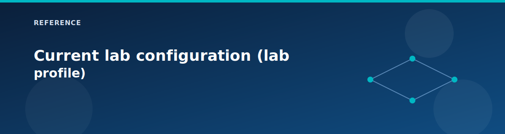

# Current lab configuration (lab profile)

<p align="center">
  
</p>


This page summarizes the active `terraform.tfvars` profile in the repo so you know what will deploy and how to reach it. The lab is based on the **5-pillar Azure Landing Zone architecture**.

For the full list of feature flags, see the **MASTER CONTROL PANEL** section at the top of `terraform.tfvars`.

## 5-Pillar deployment status

| Pillar | Status | Key Components |
|--------|--------|----------------|
| **1. Networking** | Deployed | Hub VNet, Azure Firewall (Standard), NAT Gateway, App Gateway |
| **2. Identity** | Deployed | Domain Controller (DC01), Identity VNet |
| **3. Governance** | Deployed | Management Groups, Policies, Cost Management, RBAC |
| **4. Security** | Deployed | Key Vault, Storage, SQL, Private Endpoints, Private DNS |
| **5. Management** | Deployed | Jumpbox, Log Analytics, Workbooks, Automation |

## What's on

### Pillar 1: Networking
- Region: **westus2**
- Hub/spoke topology with **Azure Firewall (Standard)**
- **Application Gateway v2** with WAF (Detection mode)
- **NAT Gateway** for fixed outbound IP

### Pillar 2: Identity Management
- Primary Domain Controller (**DC01**) deployed
- Secondary DC disabled (cost saving for lab)

### Pillar 3: Governance
- **Management Groups** with Organization hierarchy
- **Azure Policy** with allowed locations, required tags, security policies
- **Cost Management** budget ($500/mo) with alerts
- **Custom RBAC roles** for Landing Zone Admin, Network Operator
- Regulatory compliance policies enabled in **audit** mode

### Pillar 4: Security (Shared Services)
- **Key Vault** with private endpoint
- **Storage Account** with private endpoint
- **Azure SQL Database** with private endpoint
- **Private DNS Zones** for all Private Link services
- **Application Security Groups** for micro-segmentation

### Pillar 5: Management
- **Jumpbox** with public IP enabled (RDP allowed from `allowed_jumpbox_source_ips`)
- **Log Analytics** workspace (`log_retention_days = 30`, `log_daily_quota_gb = 2`)
- **Azure Workbooks** for monitoring dashboards
- **Connection Monitor** enabled (uses DC01 as the source VM)
- **Scheduled Start/Stop** for VMs (cost optimization)
- **Recovery Services Vault** disabled in current profile

### Workloads
- **Production workload** zone deployed with Load Balancer (2x IIS VMs)
- **Development workload** zone deployed (network only; no LB/IIS by default)
- **PaaS services enabled**: Static Web App, Logic Apps, Event Grid, Service Bus, App Service, Cosmos DB

## What's off (cost savings)

- VPN gateway and on-prem simulation (no VPN entry path)
- Secondary Domain Controller
- AKS
- Azure Functions
- Container Apps
- Recovery Services Vault (backup)
- VNet Flow Logs and Traffic Analytics

## Access path

1. **RDP to Jumpbox**: `terraform output -raw jumpbox_public_ip`
2. **Web Application**: Access via Application Gateway public IP or Load Balancer
3. **Firewall egress**: All spoke traffic routes through Azure Firewall

## Key caveats and recommendations

- Restrict `allowed_jumpbox_source_ips` from `0.0.0.0/0` to your IP range.
- Replace `cost_alert_emails` with real recipients for budget notifications.
- For production, enable `deploy_secondary_dc = true` for HA.
- Consider `deploy_vpn_gateway = true` for private access instead of public jumpbox.

## Quick flag snapshot (from `terraform.tfvars`)

### Pillar 1: Networking
```hcl
deploy_firewall             = true
firewall_sku_tier           = "Standard"
deploy_vpn_gateway          = false
deploy_application_gateway  = true
appgw_waf_mode              = "Detection"
deploy_nat_gateway          = true
enable_vnet_flow_logs       = false
enable_traffic_analytics    = false
```

### Pillar 2: Identity
```hcl
deploy_secondary_dc = false
```

### Pillar 3: Governance
```hcl
deploy_management_groups     = true
deploy_azure_policy          = true
deploy_cost_management       = true
cost_budget_amount           = 500
deploy_rbac_custom_roles     = true
deploy_regulatory_compliance = true
compliance_enforcement_mode  = "DoNotEnforce"
```

### Pillar 4: Security
```hcl
deploy_keyvault                    = true
deploy_storage                     = true
deploy_sql                         = true
deploy_private_dns_zones           = true
deploy_private_endpoints           = true
deploy_application_security_groups = true
```

### Pillar 5: Management
```hcl
enable_jumpbox_public_ip   = true
deploy_log_analytics       = true
deploy_backup              = false
deploy_workbooks           = true
deploy_connection_monitor  = true
enable_scheduled_startstop = true
```

### Workloads & PaaS
```hcl
deploy_workload_prod      = true
deploy_workload_dev       = true
deploy_load_balancer      = true
deploy_aks                = false
deploy_onprem_simulation  = false

# PaaS
deploy_functions          = false
deploy_static_web_app     = true
deploy_logic_apps         = true
deploy_event_grid         = true
deploy_service_bus        = true
deploy_app_service        = true
deploy_cosmos_db          = true
deploy_container_apps     = false
```

## Certification prep profiles (deltas from current lab profile)

Use these as deltas on top of the current lab configuration when you want exam-specific coverage. Apply only the changes you need for cost or time constraints.

### AZ-104 (Administrator)

```hcl
deploy_backup            = true
deploy_vpn_gateway       = true
deploy_onprem_simulation = true
deploy_secondary_dc      = true
enable_vnet_flow_logs    = true
enable_traffic_analytics = true
```

If you need to keep cost down, skip VPN and on-prem simulation and keep the monitoring changes.

### AZ-305 (Architect)

```hcl
deploy_vpn_gateway          = true
deploy_onprem_simulation    = true
deploy_secondary_dc         = true
deploy_backup               = true
enable_vnet_flow_logs       = true
enable_traffic_analytics    = true
compliance_enforcement_mode = "Default"
enable_jumpbox_public_ip    = false
```

This profile is about design coverage. If you do not want to deploy VPN or on-prem, keep them as paper design exercises and document the tradeoffs.

### AZ-400 (DevOps)

No infrastructure changes are required. Keep the lab profile and focus on the pipeline and policy-as-code pieces in `.github/workflows/terraform.yml`, `.github/actions/`, and `policies/`.

## Related pages

- [Variables reference](variables.md)
- [Lab testing guide](../testing/lab-testing-guide.md)
- [Landing zones overview](../landing-zones/README.md)
