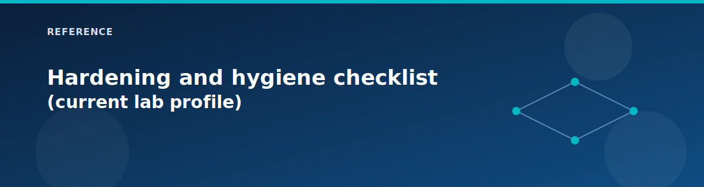

# Hardening and hygiene checklist (current lab profile)

  

Use this to keep the lab private-first after initial deployment. Firewall is on in the richer lab profile; LB and Application Gateway can be public entry points for web traffic, but management access is closed by default.

## Highest-priority fixes

- **RDP scope**: Keep `enable_jumpbox_public_ip = false` for normal lab use. If you temporarily enable it, set `allowed_jumpbox_source_ips` to trusted CIDRs only. Terraform blocks `0.0.0.0/0` unless `allow_public_rdp_from_internet = true` is set intentionally.
- **Workload RDP NAT**: Keep `enable_lb_rdp_nat_rules = false`; use private management paths instead of exposing web VM RDP through the load balancer.
- **Public entry path**: If you want no management exposure, keep public RDP disabled and set `deploy_vpn_gateway = true`; then connect via the VPN client pool.
- **Admin secrets**: Rotate `admin_password`, `sql_admin_password`, and `vpn_shared_key` to unique, strong values before apply; avoid reusing across services.

## Monitoring and diagnostics

- Turn on the management monitoring features so diagnostic settings and alerts flow into Log Analytics; adjust `log_daily_quota_gb` if you see cap messages.
- Optional: enable `enable_vnet_flow_logs` (with storage + Network Watcher) and `enable_traffic_analytics` for traffic visibility.

## Networking notes

- Firewall is on; VPN and on-prem simulation may be off, so management access should be via private paths or tightly scoped temporary public RDP.
- Private endpoints and Private DNS are on; SQL is on. Confirm Private Link DNS resolves correctly from spokes before relying on private-only endpoints.
- Application Gateway is on by default in the current profile. If you don't need it, set `deploy_application_gateway = false` to reduce cost and simplify traffic paths.

## PaaS footprint and regions

- This repo supports alternate regions for quota workarounds via `paas_alternative_location` and `cosmos_location`. The current `terraform.tfvars` uses `canadacentral` (PaaS alternative) and `northeurope` (Cosmos).
- Disable PaaS flags you do not need to reduce surface area and deployment time.

## Cost and lifecycle

- Auto-shutdown is on for VMs (`enable_auto_shutdown = true`). Keep it on for labs.
- If you do not need the load balancer/IIS demo, set `deploy_load_balancer = false` to save time and static public IP usage.

## Optional resilience

- If you need identity resiliency, set `deploy_secondary_dc = true` and ensure DNS settings propagate to spokes.
- If you need dev parity, enable `deploy_workload_dev`, but expect more cost and IP space usage.

## Related pages

- [Remote State & Secrets Management](state-and-secrets.md)
- [Security landing zone (Pillar 4: Security / Shared Services)](../landing-zones/shared-services.md)
- [Security modules](../modules/security.md)
