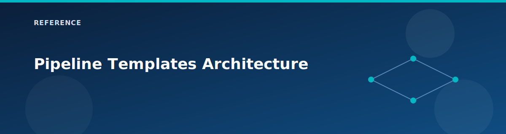

# Pipeline Templates Architecture

<p align="center">
  
</p>


This document describes the 2-level templatized pipeline architecture for the Azure Landing Zone lab.

## Overview

The pipeline uses a **2-level architecture** with composite actions for code reuse while maintaining a single visible workflow in GitHub Actions with **16 distinct job boxes**:

```
LEVEL 2: .github/workflows/terraform.yml

1️⃣ Format Check
  ↓
2️⃣ Validate
  ↓
3️⃣ Security - tfsec      3️⃣ Security - Checkov      3️⃣ Security - Secrets
4️⃣ Lint - TFLint         4️⃣ Lint - Actions          4️⃣ Lint - Docs
  ↓
5️⃣ Analysis - Graph      5️⃣ Analysis - Versions
  ↓                       ↓
6️⃣ Analysis - Cost       7️⃣ Plan
                           ↓
                         4️⃣ Lint - Policy
                           ↓
8️⃣ Apply (manual)       9️⃣ Destroy (manual)
  ↓
🔟 Metrics
```


### Key Design Decisions

| Decision | Reason |
|----------|--------|
| Single visible workflow | Clean UI - only one "Terraform Pipeline" appears in GitHub Actions |
| 16 separate job boxes | Visual progress tracking - each stage is visible as separate box |
| Composite actions for complex jobs | Plan/Apply/Destroy logic is reusable and maintainable; cost/graph/docs/version/policy are reusable blocks too |
| Inline steps for simple jobs | Format/Validate/Security scans are simple enough to inline |

---

## Level 1: Composite Actions

Composite actions are reusable step sequences stored in `.github/actions/`. They encapsulate complex operations into single, reusable units that do NOT appear in the GitHub Actions workflow list.

### Location

```
.github/actions/
├── validate/
│   └── action.yml      ← Format + validate (optional, not currently used)
├── security/
│   └── action.yml      ← Security scans (optional, not currently used)
├── plan/
│   └── action.yml      ← Terraform init + plan with outputs
├── apply/
│   └── action.yml      ← Download artifact + apply
└── destroy/
    └── action.yml      ← Confirmation check + destroy
```

### Composite Action: plan/action.yml

The plan action handles initialization and planning with change detection.

**Inputs:**
| Input | Type | Required | Default | Description |
|-------|------|----------|---------|-------------|
| `terraform_version` | string | No | `1.9.0` | Terraform version |
| `working_directory` | string | No | `.` | Working directory |
| `azure_client_id` | string | Yes | - | App/client ID for GitHub OIDC |
| `azure_tenant_id` | string | Yes | - | Azure tenant ID |
| `azure_subscription_id` | string | Yes | - | Azure subscription ID |
| `backend_resource_group` | string | Yes | - | State storage RG |
| `backend_storage_account` | string | Yes | - | State storage account |
| `backend_container` | string | No | `tfstate` | State container |
| `state_key` | string | Yes | - | State file key |
| `var_file` | string | Yes | - | Variables file path |
| `environment` | string | Yes | - | Environment name |

**Outputs:**
| Output | Description |
|--------|-------------|
| `has_changes` | `true` if plan has changes, `false` otherwise |
| `add` | Number of resources to add |
| `change` | Number of resources to change |
| `destroy` | Number of resources to destroy |

**What it does:**
1. Sets up Terraform with specified version
2. Logs into Azure using GitHub OIDC federation
3. Sets `ARM_USE_OIDC=true` and AzureRM provider identity variables
4. Initializes backend with dynamic configuration
5. Runs `terraform plan -detailed-exitcode`
6. Parses plan output for resource counts
7. Uploads plan artifact for apply stage

### Composite Action: apply/action.yml

The apply action downloads the plan artifact and applies it.

**Inputs:**
| Input | Type | Required | Description |
|-------|------|----------|-------------|
| `terraform_version` | string | No | Terraform version |
| `azure_client_id` | string | Yes | App/client ID for GitHub OIDC |
| `azure_tenant_id` | string | Yes | Azure tenant ID |
| `azure_subscription_id` | string | Yes | Azure subscription ID |
| `backend_resource_group` | string | Yes | State storage RG |
| `backend_storage_account` | string | Yes | State storage account |
| `state_key` | string | Yes | State file key |
| `environment` | string | Yes | Environment name |
| `plan_artifact` | string | Yes | Artifact name containing tfplan |

**What it does:**
1. Sets up Terraform and Azure authentication
2. Downloads plan artifact from previous stage
3. Initializes backend
4. Runs `terraform apply tfplan`
5. Generates GitHub Step Summary with results

### Composite Action: destroy/action.yml

The destroy action requires explicit confirmation before destroying infrastructure.

**Inputs:**
| Input | Type | Required | Description |
|-------|------|----------|-------------|
| `terraform_version` | string | No | Terraform version |
| `azure_client_id` | string | Yes | App/client ID for GitHub OIDC |
| `azure_tenant_id` | string | Yes | Azure tenant ID |
| `azure_subscription_id` | string | Yes | Azure subscription ID |
| `backend_*` | string | Yes | Backend configuration |
| `var_file` | string | Yes | Variables file |
| `environment` | string | Yes | Environment name |
| `confirm` | string | Yes | Must be "DESTROY" to proceed |

**What it does:**
1. Validates confirmation equals "DESTROY"
2. Fails immediately if confirmation is wrong
3. Sets up Terraform and Azure authentication
4. Initializes backend
5. Runs `terraform destroy -auto-approve -var-file=...`
6. Generates GitHub Step Summary

---

## Level 2: Orchestrator Workflow

The main workflow (`terraform.yml`) orchestrates all jobs and is the **only workflow visible** in GitHub Actions.

### File Location

```
.github/workflows/terraform.yml
```

### Workflow Structure

```yaml
name: 'Terraform Pipeline'

on:
  push:
    branches: [main]
    paths:
      - '**.tf'
      - '**.tfvars'
      - '.github/**'
      - 'modules/**'
      - 'landing-zones/**'
      - 'environments/**'
      - 'policies/**'
      - 'README.md'
      - 'wiki/**'
      - 'docs/**'
  pull_request:
    branches: [main]
    paths:
      - '**.tf'
      - '**.tfvars'
      - '.github/**'
      - 'modules/**'
      - 'landing-zones/**'
      - 'environments/**'
      - 'policies/**'
      - 'README.md'
      - 'wiki/**'
      - 'docs/**'
  workflow_dispatch:
    inputs:
      environment: [cheap-lab, dev, lab, prod]
      action: [plan, apply, destroy]
      destroy_confirm: string

env:
  TF_VERSION: '1.9.0'
  ENVIRONMENT: ${{ github.event.inputs.environment || 'lab' }}

jobs:
  format:           # 1️⃣ Format Check
  validate:         # 2️⃣ Validate
  security-tfsec:   # 3️⃣ Security - tfsec
  security-checkov: # 3️⃣ Security - Checkov
  secret-scan:      # 3️⃣ Security - Secrets (Gitleaks)
  tflint:           # 4️⃣ Lint - TFLint
  policy-check:     # 4️⃣ Lint - Policy (Conftest; skipped on pull_request)
  terraform-docs:   # 4️⃣ Lint - Docs (terraform-docs)
  actionlint:       # 4️⃣ Lint - Actions
  graph:            # 5️⃣ Analysis - Graph
  module-versions:  # 5️⃣ Analysis - Versions
  cost-estimate:    # 6️⃣ Analysis - Cost (Infracost)
  plan:             # 7️⃣ Plan (composite; skipped on pull_request)
  apply:            # 8️⃣ Apply (composite)
  destroy:          # 9️⃣ Destroy (composite)
  metrics:          # 🔟 Metrics
```
### Job Dependencies

```
format → validate → [tfsec, checkov, secret-scan, tflint, actionlint, terraform-docs]
                                   ↘
                               graph, module-versions
                      ↘                       ↙
               cost-estimate             plan (change counts)
                                           ↓
                                      policy-check
                      ↘                       ↙
                 apply (manual, action=apply, has_changes=true)
                 destroy (manual, action=destroy)
                            ↓
                         metrics (after successful apply)
```

- Graph and module-versions wait for security scanning, secrets, TFLint, and actionlint.
- Policy-check runs after Plan because it evaluates the saved `tfplan` artifact.
- Cost estimation soft-fails but still completes before apply.
- Apply runs only when `action=apply` (manual dispatch) and `plan` reports changes.
- Destroy runs only when `action=destroy` with confirmation.
- Metrics run after a successful apply to capture duration and resource deltas.

### How Jobs Use Composite Actions

### How Jobs Use Composite Actions

**Plan Job:**
```yaml
plan:
  name: '7️⃣ Plan'
  needs: [graph, module-versions]
  steps:
    - uses: actions/checkout@v4
    - uses: ./.github/actions/plan
      with:
        terraform_version: ${{ env.TF_VERSION }}
        azure_client_id: ${{ secrets.AZURE_CLIENT_ID }}
        azure_tenant_id: ${{ secrets.AZURE_TENANT_ID }}
        azure_subscription_id: ${{ secrets.AZURE_SUBSCRIPTION_ID }}
        backend_resource_group: ${{ secrets.TF_STATE_RG }}
        backend_storage_account: ${{ secrets.TF_STATE_SA }}
        state_key: ${{ env.ENVIRONMENT }}.terraform.tfstate
        var_file: environments/${{ env.ENVIRONMENT }}.tfvars
        environment: ${{ env.ENVIRONMENT }}
```

**Apply Job:**
```yaml
apply:
  name: '8️⃣ Apply'
  needs: [plan, cost-estimate, policy-check]
  if: github.event.inputs.action == 'apply' && needs.plan.outputs.has_changes == 'true'
  steps:
    - uses: actions/checkout@v4
    - uses: ./.github/actions/apply
      with:
        plan_artifact: tfplan-${{ env.ENVIRONMENT }}-${{ github.sha }}
        # ... other inputs
```

**Destroy Job:**
```yaml
destroy:
  name: '9️⃣ Destroy'
  needs: plan
  if: github.event.inputs.action == 'destroy'
  steps:
    - uses: actions/checkout@v4
    - uses: ./.github/actions/destroy
      with:
        confirm: ${{ github.event.inputs.destroy_confirm }}
        # ... other inputs
```

---

## Benefits of This Architecture

### 1. Clean UI
- Only ONE workflow appears in GitHub Actions sidebar
- All 16 job stages are visible as separate boxes
- Clear visual progress through the pipeline

### 2. Code Reuse
- Complex logic (plan/apply/destroy) is in composite actions
- Simple jobs (format/validate/security) are inline
- Easy to update logic in one place

### 3. Maintainability
- Composite actions can be versioned and tested independently
- Changes to plan logic don't require modifying the main workflow
- Clear separation of concerns

### 4. Flexibility
- Can add new composite actions for new functionality
- Can modify job dependencies easily
- Supports multiple environments without duplication

---

## Extending the Pipeline

### Add a New Composite Action

Create `.github/actions/my-action/action.yml`:

```yaml
name: 'My Custom Action'
description: 'Does something useful'

inputs:
  my_input:
    description: 'Input description'
    required: true

outputs:
  result:
    description: 'Result of the action'
    value: ${{ steps.run.outputs.result }}

runs:
  using: 'composite'
  steps:
    - name: Run
      id: run
      shell: bash
      run: |
        echo "Processing: ${{ inputs.my_input }}"
        echo "result=success" >> $GITHUB_OUTPUT
```

### Add a New Job to the Workflow

```yaml
# In terraform.yml, add:
my-job:
  name: '8️⃣ My New Job'
  runs-on: ubuntu-latest
  needs: plan
  steps:
    - uses: actions/checkout@v4
    - uses: ./.github/actions/my-action
      with:
        my_input: 'value'
```

---

## File Structure Summary

```
.github/
├── actions/                    # Level 1: Composite Actions (hidden)
│   ├── validate/
│   │   └── action.yml
│   ├── security/
│   │   └── action.yml
│   ├── plan/
│   │   └── action.yml         # ~130 lines
│   ├── apply/
│   │   └── action.yml         # ~85 lines
│   └── destroy/
│       └── action.yml         # ~90 lines
│
└── workflows/                  # Level 2: Orchestrator (visible)
    └── terraform.yml          # ~300 lines, 16 jobs
```

---

## See Also

- [Pipeline Overview](pipeline.md) - Main pipeline documentation with setup instructions
- [GitHub Actions - Composite Actions](https://docs.github.com/en/actions/creating-actions/creating-a-composite-action)
- [GitHub Actions - Reusing Workflows](https://docs.github.com/en/actions/using-workflows/reusing-workflows)

## Related pages

- [AZ-400 study path (Designing and Implementing Microsoft DevOps Solutions)](../certifications/az-400.md)
- [Remote State & Secrets Management](state-and-secrets.md)
