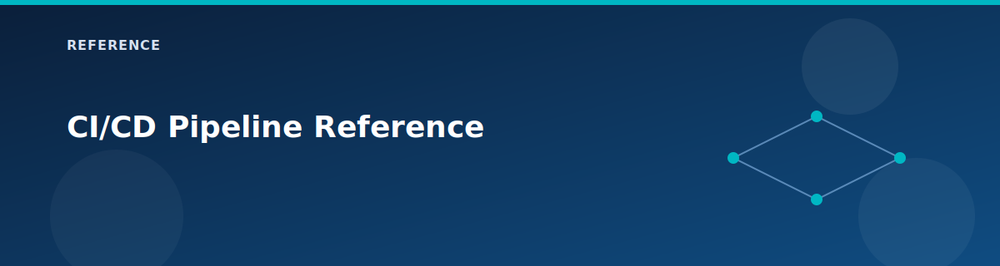

# CI/CD Pipeline Reference

<p align="center">
  
</p>


This document describes the GitHub Actions pipeline used to deploy and manage the Azure Landing Zone Lab infrastructure.

## Overview

The pipeline is defined in [`.github/workflows/terraform.yml`](../../.github/workflows/terraform.yml) and provides a complete CI/CD workflow for Terraform with **15 visible job stages**:

- **1?? Format Check** → **2?? Validate**
- **3?? Security - tfsec**, **3?? Security - Checkov**, **3?? Security - Secrets** (Gitleaks)
- **4?? Lint - TFLint**, **4?? Lint - Policy** (Conftest), **4?? Lint - Docs** (terraform-docs)
- **5?? Analysis - Graph**, **5?? Analysis - Versions**
- **6?? Analysis - Cost** (Infracost, soft-fail)
- **7?? Plan** (change detection + plan artifact)
- **8?? Apply** (manual `action=apply`; includes state backup, resource inventory, changelog)
- **9?? Destroy** (manual `action=destroy` + `DESTROY` confirm)
- **📊 Metrics** (after successful Apply)

Artifacts: plan file + summary, terraform-docs output, dependency graph, provider/module versions, cost report, changelog, resource inventory, and metrics JSON.

### Architecture: 2-Level Template Structure

The pipeline uses a 2-level architecture for reuse and visibility:

- **Level 2 – Orchestrator** (`.github/workflows/terraform.yml`): 15 jobs with dependencies: format → validate → security/linters/docs → graph + module versions → cost + plan → apply/destroy → metrics. Apply only runs on `workflow_dispatch` with `action=apply` and detected changes; destroy only runs with `action=destroy` and confirmation.
- **Level 1 – Composite actions** (`.github/actions/`): reusable building blocks for plan, apply, destroy, state-backup, cost-estimate (Infracost), graph, module-version, policy-check (Conftest), terraform-docs generation, secret-scan (Gitleaks wrapper), resource-inventory, changelog, metrics, and terratest. Format/validate/tfsec/checkov/tflint stay inline for visibility.

> Composite actions live in `.github/actions/` and do not appear as separate workflows in the Actions UI.

---


## Initial Setup (One-Time Configuration)

Before using the pipeline, you must complete these one-time setup steps.

### Step 1: Authenticate with Azure

```bash
# Login to Azure CLI
az login

# Set your subscription
az account set --subscription "<SUBSCRIPTION_ID>"

# Verify
az account show --query "{Name:name, ID:id}" -o table
```

### Step 2: Create Service Principal

The pipeline needs a Service Principal with sufficient permissions to manage Azure resources.

```bash
# Create SP with Owner role
az ad sp create-for-rbac \
  --name "terraform-alz-pipeline" \
  --role Owner \
  --scopes /subscriptions/<SUBSCRIPTION_ID> \
  --sdk-auth
```

**Save the output** - you'll need these values:
```json
{
  "clientId": "xxxxxxxx-xxxx-xxxx-xxxx-xxxxxxxxxxxx",
  "clientSecret": "xxxxxxxxxxxxxxxxxxxxxxxxxxxxxx",
  "subscriptionId": "xxxxxxxx-xxxx-xxxx-xxxx-xxxxxxxxxxxx",
  "tenantId": "xxxxxxxx-xxxx-xxxx-xxxx-xxxxxxxxxxxx"
}
```

> **Why Owner role?** The landing zone creates role assignments, policy assignments, and role definitions which require:
> - `Microsoft.Authorization/roleAssignments/write`
> - `Microsoft.Authorization/policyAssignments/write`
> - `Microsoft.Authorization/roleDefinitions/write`
>
> Only Owner (or custom combination of User Access Administrator + Contributor + Resource Policy Contributor) provides these.

### Step 3: Create Terraform State Storage

Terraform requires a remote backend to store state files. Create an Azure Storage Account:

```powershell
# Variables
$RESOURCE_GROUP = "rg-terraform-state"
$LOCATION = "westus2"
$RANDOM_SUFFIX = Get-Random -Maximum 9999
$STORAGE_ACCOUNT = "stterraformstate$RANDOM_SUFFIX"

# Create resource group
az group create --name $RESOURCE_GROUP --location $LOCATION

# Create storage account with security best practices
az storage account create `
  --name $STORAGE_ACCOUNT `
  --resource-group $RESOURCE_GROUP `
  --location $LOCATION `
  --sku Standard_LRS `
  --kind StorageV2 `
  --encryption-services blob `
  --min-tls-version TLS1_2 `
  --allow-blob-public-access false `
  --https-only true

# Create container for state files
az storage container create `
  --name tfstate `
  --account-name $STORAGE_ACCOUNT

# Output the storage account name (save this!)
Write-Host "Storage Account: $STORAGE_ACCOUNT"
```

**Or using Bash:**
```bash
RESOURCE_GROUP="rg-terraform-state"
LOCATION="westus2"
STORAGE_ACCOUNT="stterraformstate$RANDOM"

az group create --name $RESOURCE_GROUP --location $LOCATION

az storage account create \
  --name $STORAGE_ACCOUNT \
  --resource-group $RESOURCE_GROUP \
  --sku Standard_LRS \
  --encryption-services blob \
  --min-tls-version TLS1_2

az storage container create \
  --name tfstate \
  --account-name $STORAGE_ACCOUNT

echo "Storage Account: $STORAGE_ACCOUNT"
```

### Step 4: Configure GitHub Secrets

Authenticate with GitHub CLI and set the required secrets:

```bash
# Authenticate with GitHub
gh auth login

# Set secrets (replace with your actual values)
gh secret set AZURE_CLIENT_ID --body "<CLIENT_ID>"
gh secret set AZURE_CLIENT_SECRET --body "<CLIENT_SECRET>"
gh secret set AZURE_SUBSCRIPTION_ID --body "<SUBSCRIPTION_ID>"
gh secret set AZURE_TENANT_ID --body "<TENANT_ID>"
gh secret set TF_STATE_RG --body "rg-terraform-state"
gh secret set TF_STATE_SA --body "<STORAGE_ACCOUNT_NAME>"

# Set AZURE_CREDENTIALS as JSON object
gh secret set AZURE_CREDENTIALS --body '{
  "clientId": "<CLIENT_ID>",
  "clientSecret": "<CLIENT_SECRET>",
  "subscriptionId": "<SUBSCRIPTION_ID>",
  "tenantId": "<TENANT_ID>"
}'
```

### Step 5: Verify Setup

```bash
# List configured secrets
gh secret list

# Test the pipeline with a plan
gh workflow run "Terraform Pipeline" -f action=plan -f environment=lab
gh run watch
```

### Setup Summary

After completing setup, you will have:

```
Azure Subscription
├── Service Principal: terraform-alz-pipeline
│   └── Role: Owner at subscription scope
│
└── Resource Group: rg-terraform-state
    └── Storage Account: stterraformstateXXXX
        └── Container: tfstate
            ├── lab.terraform.tfstate
            ├── dev.terraform.tfstate
            └── prod.terraform.tfstate (when used)

GitHub Repository
└── Secrets
    ├── AZURE_CLIENT_ID
    ├── AZURE_CLIENT_SECRET
    ├── AZURE_SUBSCRIPTION_ID
    ├── AZURE_TENANT_ID
    ├── AZURE_CREDENTIALS (JSON)
    ├── TF_STATE_RG
    └── TF_STATE_SA
```

---

## Pipeline Jobs

The pipeline now has **15 visible jobs**:

| # | Name | Purpose | Blocks Deploy? |
|---|------|---------|----------------|
| 1 | **1?? Format Check** | `terraform fmt -check -recursive` | ✅ Yes |
| 2 | **2?? Validate** | `terraform init -backend=false` + `terraform validate` | ✅ Yes |
| 3 | **3?? Security - tfsec** | Static security scan (SARIF upload, soft-fail) | ⚠️ Soft |
| 4 | **3?? Security - Checkov** | Policy-as-code scan (SARIF upload, soft-fail) | ⚠️ Soft |
| 5 | **3?? Security - Secrets** | Gitleaks secret scan | ✅ Fails on leak |
| 6 | **4?? Lint - TFLint** | Azure rules linting | ⚠️ Soft |
| 7 | **4?? Lint - Policy** | OPA/Conftest against tfplan | ⚠️ Soft by default |
| 8 | **4?? Lint - Docs** | Generate terraform-docs artifact | ✅ Yes |
| 9 | **5?? Analysis - Graph** | Terraform dependency graph artifact | ✅ Yes |
| 10 | **5?? Analysis - Versions** | Provider/module version snapshot | ✅ Yes |
| 11 | **6?? Analysis - Cost** | Infracost estimate (uses `INFRACOST_API_KEY`) | ⚠️ Soft |
| 12 | **7?? Plan** | Change detection + plan artifact + summary counts | ✅ Yes |
| 13 | **8?? Apply** | Manual deploy (state backup → apply → inventory → changelog) | ▶️ Manual |
| 14 | **9?? Destroy** | Manual destroy with `DESTROY` confirmation | ▶️ Manual |
| 15 | **?? Metrics** | Post-apply metrics JSON + summary | ℹ️ Reporting |

### Job Dependencies

```
format → validate → [tfsec, checkov, secret-scan, tflint, policy-check, terraform-docs]
                                   ↘                          ↙
                               graph, module-versions
                      ↘                       ↙
               cost-estimate             plan (change counts)
                      ↘                       ↙
                   apply (manual, action=apply, has_changes=true)
                   destroy (manual, action=destroy)
                              ↓
                           metrics (after successful apply)
```

- Graph and module-versions wait for all security/lint/doc jobs.
- Cost estimation soft-fails but still blocks apply until it finishes.
- Apply runs only on `workflow_dispatch` with `action=apply` and `has_changes=true` from Plan.
- Destroy runs only on `workflow_dispatch` with `action=destroy` and confirmation text.
- Metrics run after a successful Apply to capture duration and counts.

## Triggers

### Automatic Triggers

| Event | What Happens |
|-------|--------------|
| **Push to `main`** | Runs format/validate → security/linters/docs → graph/version → cost → plan (no auto-apply) |
| **Pull Request to `main`** | Same checks + plan for review; no PR comment is posted |

**Path Filters**: Pipeline runs when these paths change:
- `**.tf` - Terraform configuration files
- `**.tfvars` - Variable files
- `modules/**` - Module changes
- `landing-zones/**` - Landing zone changes
- `environments/**` - Environment configurations

### Manual Trigger (workflow_dispatch)

Start from **GitHub → Actions → Terraform Pipeline → Run workflow** and set:

| Input | Options | Description |
|-------|---------|-------------|
| **Action** | `plan`, `apply`, `destroy` | Plan always runs; Apply runs only when `action=apply`; Destroy runs only when `action=destroy`. |
| **Environment** | `lab`, `dev`, `prod` | Selects the tfvars/state key (default lab) |
| **Destroy confirm** | Type `DESTROY` | Required safety confirmation for destroy |

Apply is further gated on `has_changes=true` from the Plan job.

## Required Secrets

Configure these in **GitHub → Settings → Secrets and variables → Actions**:

| Secret | Description | Example |
|--------|-------------|---------|
| `AZURE_CLIENT_ID` | Service Principal App ID | `xxxxxxxx-xxxx-xxxx-xxxx-xxxxxxxxxxxx` |
| `AZURE_CLIENT_SECRET` | Service Principal secret | `xxxxxxxxxxxxxxxxxxxxxxxxxxxxxx` |
| `AZURE_SUBSCRIPTION_ID` | Target Azure subscription | `xxxxxxxx-xxxx-xxxx-xxxx-xxxxxxxxxxxx` |
| `AZURE_TENANT_ID` | Azure AD tenant ID | `xxxxxxxx-xxxx-xxxx-xxxx-xxxxxxxxxxxx` |
| `AZURE_CREDENTIALS` | JSON credentials object | See below |
| `TF_STATE_RG` | Resource group for tfstate | `rg-terraform-state` |
| `TF_STATE_SA` | Storage account for tfstate | `stterraformstateXXXX` |
| `INFRACOST_API_KEY` | (Optional) enables cost-estimate stage | - |

### AZURE_CREDENTIALS Format

```json
{
  "clientId": "<AZURE_CLIENT_ID>",
  "clientSecret": "<AZURE_CLIENT_SECRET>",
  "subscriptionId": "<AZURE_SUBSCRIPTION_ID>",
  "tenantId": "<AZURE_TENANT_ID>"
}
```

## Service Principal & Authentication

### How Authentication Works

```
┌─────────────────┐     ┌─────────────────┐     ┌─────────────────┐
│  GitHub Actions │────▶│  Azure Login    │────▶│  Azure APIs     │
│  (Runner)       │     │  (az login)     │     │  (ARM)          │
└─────────────────┘     └─────────────────┘     └─────────────────┘
        │                       │                       │
        │ AZURE_CREDENTIALS     │ OAuth Token           │ API Calls
        │ (from secrets)        │                       │
        ▼                       ▼                       ▼
┌─────────────────────────────────────────────────────────────────┐
│                    Service Principal                            │
│                    terraform-alz-pipeline                       │
│                                                                 │
│  Client ID:     xxxxxxxx-xxxx-xxxx-xxxx-xxxxxxxxxxxx           │
│  Object ID:     yyyyyyyy-yyyy-yyyy-yyyy-yyyyyyyyyyyy           │
│  Tenant ID:     zzzzzzzz-zzzz-zzzz-zzzz-zzzzzzzzzzzz           │
│                                                                 │
│  Assigned Roles:                                                │
│  └── Owner @ /subscriptions/<subscription-id>                   │
│      ├── Microsoft.Resources/*         (create resources)      │
│      ├── Microsoft.Authorization/*     (role assignments)      │
│      └── Microsoft.Authorization/*     (policy assignments)    │
└─────────────────────────────────────────────────────────────────┘
```

### Authentication Flow in Pipeline

1. **GitHub Runner starts** - Spins up Ubuntu container
2. **Azure Login action** - Uses `AZURE_CREDENTIALS` secret to authenticate
3. **Token acquired** - Azure AD issues OAuth token for the Service Principal
4. **Terraform uses token** - AzureRM provider uses the authenticated session
5. **API calls made** - All Azure resource operations use the SP identity

### Service Principal Management

**View your Service Principal:**
```bash
# List all SPs with "terraform" in name
az ad sp list --display-name "terraform" --query "[].{Name:displayName, AppId:appId}" -o table

# Get details
az ad sp show --id <APP_ID>
```

**Check role assignments:**
```bash
az role assignment list --assignee <APP_ID> -o table
```

**Rotate the secret:**
```bash
# Create new secret (old ones remain valid until expiry)
az ad sp credential reset --id <APP_ID> --append

# Update GitHub secret
gh secret set AZURE_CLIENT_SECRET --body "<NEW_SECRET>"
gh secret set AZURE_CREDENTIALS --body '{"clientId":"...","clientSecret":"<NEW_SECRET>",...}'
```

**Delete the Service Principal:**
```bash
az ad sp delete --id <APP_ID>
```

### Required Permissions

The Service Principal needs these permissions:

| Permission | Purpose |
|------------|---------|
| **Owner** or **Contributor** | Create/manage Azure resources |
| **User Access Administrator** | Create role assignments |
| **Resource Policy Contributor** | Create policy assignments |

> **Note**: Using `Owner` role provides all required permissions. For production, use least-privilege with specific roles.

## Backend Configuration

The pipeline uses Azure Storage for remote Terraform state, enabling:
- **Shared state** - Multiple team members can work together
- **State locking** - Prevents concurrent modifications
- **Encryption at rest** - State files are encrypted in Azure Storage
- **Versioning** - Blob versioning provides state history

### How State Storage Works

```
┌─────────────────────────────────────────────────────────────────────┐
│                    Azure Storage Account                            │
│                    (stterraformstateXXXX)                          │
├─────────────────────────────────────────────────────────────────────┤
│  Container: tfstate                                                 │
│  ├── lab.terraform.tfstate      ← Lab environment state            │
│  ├── dev.terraform.tfstate      ← Dev environment state            │
│  └── prod.terraform.tfstate     ← Prod environment state           │
│                                                                     │
│  Each state file contains:                                          │
│  • Resource IDs and attributes                                      │
│  • Dependencies between resources                                   │
│  • Outputs from the deployment                                      │
│  • Provider metadata                                                │
└─────────────────────────────────────────────────────────────────────┘
```

### Backend Configuration in Code

The backend is configured in [`backend.tf`](../../backend.tf):

```hcl
terraform {
  backend "azurerm" {
    container_name = "tfstate"
    # These are set via -backend-config in the pipeline:
    # resource_group_name  = "rg-terraform-state"
    # storage_account_name = "stterraformstateXXXX"
    # key                  = "lab.terraform.tfstate"
  }
}
```

### Pipeline Backend Initialization

The pipeline initializes the backend dynamically using secrets:

```bash
terraform init \
  -backend-config="resource_group_name=$TF_STATE_RG" \
  -backend-config="storage_account_name=$TF_STATE_SA" \
  -backend-config="container_name=tfstate" \
  -backend-config="key=<environment>.terraform.tfstate"
```

This allows the same code to deploy to different environments with isolated state files.

### State File Isolation

Each environment has its own state file, providing:

| Benefit | Description |
|---------|-------------|
| **Isolation** | Changes to lab don't affect prod state |
| **Parallel deploys** | Deploy to multiple environments simultaneously |
| **Independent lifecycle** | Destroy lab without affecting dev |
| **Separate locking** | No contention between environments |

### State Locking

Terraform uses blob leases for state locking:

```
User A: terraform apply (acquires lock)
User B: terraform apply → ERROR: state blob is already locked
User A: apply completes (releases lock)
User B: can now run apply
```

If a lock gets stuck (e.g., pipeline cancellation), force unlock:

```bash
terraform force-unlock -force <LOCK_ID>
```

### Local Backend (Development)

For local development without the pipeline:

```bash
# Initialize with local backend (no Azure storage)
terraform init

# Or reconfigure to use Azure storage
terraform init \
  -backend-config="resource_group_name=rg-terraform-state" \
  -backend-config="storage_account_name=stterraformstateXXXX" \
  -backend-config="key=lab.terraform.tfstate" \
  -reconfigure
```

## Environment Files

The pipeline uses environment-specific variable files:

| Environment | File | State Key |
|-------------|------|-----------|
| Lab | `environments/lab.tfvars` | `lab.terraform.tfstate` |
| Dev | `environments/dev.tfvars` | `dev.terraform.tfstate` |
| Prod | `environments/prod.tfvars` | `prod.terraform.tfstate` |

## Pipeline Features

### Concurrency Control

```yaml
concurrency:
  group: terraform-${{ github.ref }}-${{ github.event.inputs.environment || 'lab' }}
  cancel-in-progress: false
```

Only one pipeline per branch/environment runs at a time. New runs wait for completion.

### Plan Artifacts

The plan file is saved as a GitHub artifact for 5 days:
- **Name**: `tfplan-<environment>-<commit-sha>`
- **Contents**: `tfplan`, `plan_output.txt`

### PR Comments

On pull requests, the pipeline automatically comments with the plan summary:

```markdown
## 📋 Terraform Plan - lab

| Action | Count |
|--------|-------|
| ➕ Add | 42 |
| 🔄 Change | 3 |
| ➖ Destroy | 0 |
```

### Step Summaries

Each stage writes to the GitHub Step Summary for easy visibility:
- ✅ Success indicators
- ❌ Failure details
- 📋 Plan/Apply counts

## Security Scanning

### tfsec

Runs [tfsec](https://github.com/aquasecurity/tfsec) for Terraform security analysis:
- Checks for misconfigurations
- Uploads SARIF to GitHub Security tab
- Soft-fail (doesn't block deployment)

### Checkov

Runs [Checkov](https://www.checkov.io/) for policy-as-code:
- 750+ built-in policies
- CIS, SOC2, HIPAA benchmarks
- Uploads SARIF to GitHub Security tab
- Soft-fail (doesn't block deployment)

### TFLint

Runs [TFLint](https://github.com/terraform-linters/tflint) with Azure ruleset:
- Azure-specific best practices
- Deprecated resource checks
- Soft-fail (doesn't block deployment)

## Usage Examples

### Deploy Lab Environment

```bash
# Via GitHub CLI
gh workflow run "Terraform Pipeline" -f action=apply -f environment=lab

# Watch the run
gh run watch
```

### Plan Only (No Changes)

```bash
gh workflow run "Terraform Pipeline" -f action=plan -f environment=lab
```

### Destroy Environment

```bash
gh workflow run "Terraform Pipeline" \
  -f action=destroy \
  -f environment=lab \
  -f destroy_confirm=DESTROY
```

### Check Run Status

```bash
# List recent runs
gh run list --workflow="terraform.yml" --limit 5

# View specific run
gh run view <RUN_ID>

# View logs
gh run view <RUN_ID> --log
```

## Troubleshooting

### State Lock Errors

If you see "state blob is already locked":

```bash
terraform force-unlock -force <LOCK_ID>
```

### Permission Errors

If you see "AuthorizationFailed" errors:
1. Verify Service Principal has Owner role
2. Wait 5-10 minutes for role propagation
3. Re-run the pipeline

### Format Check Failures

Fix locally before pushing:

```bash
terraform fmt -recursive
```

### Plan Shows No Changes

The Apply stage skips if no changes detected. This is expected behavior.

## Related Documentation

- [Pipeline Templates Architecture](pipeline-templates.md) - 2-level template structure details
- [Variables Reference](variables.md) - Input variables
- [Outputs Reference](outputs.md) - Deployment outputs
- [Architecture Overview](../architecture/overview.md) - Infrastructure design

## Related pages

- [AZ-400 study path (Designing and Implementing Microsoft DevOps Solutions)](../certifications/az-400.md)
- [Module design patterns](../modules/README.md)
