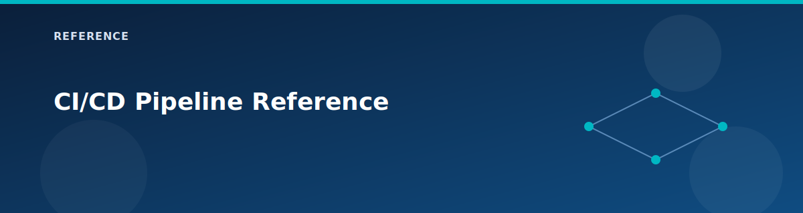

# CI/CD Pipeline Reference

<p align="center">
  
</p>


This document describes the GitHub Actions pipeline used to deploy and manage the Azure Landing Zone Lab infrastructure.

## Overview

The pipeline is defined in [`.github/workflows/terraform.yml`](../../.github/workflows/terraform.yml) and provides a complete CI/CD workflow for Terraform with **16 visible job stages**:

- **1️⃣ Format Check** → **2️⃣ Validate**
- **3️⃣ Security - tfsec**, **3️⃣ Security - Checkov**, **3️⃣ Security - Secrets** (Gitleaks)
- **4️⃣ Lint - TFLint**, **4️⃣ Lint - Policy** (Conftest; skipped on PRs), **4️⃣ Lint - Docs** (terraform-docs), **4️⃣ Lint - Actions** (actionlint)
- **5️⃣ Analysis - Graph**, **5️⃣ Analysis - Versions**
- **6️⃣ Analysis - Cost** (Infracost, soft-fail)
- **7️⃣ Plan** (change detection + plan artifact; skipped on PRs)
- **8️⃣ Apply** (manual `action=apply`; includes state backup, resource inventory, changelog)
- **9️⃣ Destroy** (manual `action=destroy` + `DESTROY` confirm)
- **🔟 Metrics** (after successful Apply)

Depending on the trigger, artifacts include the plan file + summary, terraform-docs output, dependency graph, provider/module versions, cost report, changelog, resource inventory, and metrics JSON. Pull requests do not produce plan or downstream deployment artifacts.

### Architecture: 2-Level Template Structure

The pipeline uses a 2-level architecture for reuse and visibility:

- **Level 2 – Orchestrator** (`.github/workflows/terraform.yml`): 16 jobs with dependencies: format → validate → security/linters/docs/actionlint → graph + module versions → cost + plan → policy check → apply/destroy → metrics. Apply only runs on `workflow_dispatch` with `action=apply` and detected changes; destroy only runs with `action=destroy` and confirmation.
- **Level 1 – Composite actions** (`.github/actions/`): reusable building blocks for plan, apply, destroy, state-backup, cost-estimate (Infracost), graph, module-version, policy-check (Conftest), terraform-docs generation, secret-scan (Gitleaks wrapper), resource-inventory, changelog, metrics, and terratest. Format/validate/tfsec/checkov/tflint stay inline for visibility.

> Composite actions live in `.github/actions/` and do not appear as separate workflows in the Actions UI.

---


## Initial Setup (One-Time Configuration)

Before using the pipeline, create remote state storage and a GitHub OIDC app registration. The workflow does not use a stored Azure client secret.

### Step 1: Authenticate with Azure

```bash
az login
az account set --subscription "<SUBSCRIPTION_ID>"
az account show --query "{Name:name, ID:id, Tenant:tenantId}" -o table
```

### Step 2: Create Terraform State Storage

Terraform requires a remote backend to store state files. Create an Azure Storage Account:

```powershell
# Variables
$RESOURCE_GROUP = "rg-terraform-state"
$LOCATION = "westus2"
$RANDOM_SUFFIX = Get-Random -Maximum 9999
$STORAGE_ACCOUNT = "stterraformstate$RANDOM_SUFFIX"

# Create resource group
az group create --name $RESOURCE_GROUP --location $LOCATION

# Create storage account with security best practices
az storage account create `
  --name $STORAGE_ACCOUNT `
  --resource-group $RESOURCE_GROUP `
  --location $LOCATION `
  --sku Standard_LRS `
  --kind StorageV2 `
  --encryption-services blob `
  --min-tls-version TLS1_2 `
  --allow-blob-public-access false `
  --https-only true

# Create container for state files
az storage container create `
  --name tfstate `
  --account-name $STORAGE_ACCOUNT `
  --auth-mode login

# Output the storage account name (save this!)
Write-Host "Storage Account: $STORAGE_ACCOUNT"
```

**Or using Bash:**
```bash
RESOURCE_GROUP="rg-terraform-state"
LOCATION="westus2"
STORAGE_ACCOUNT="stterraformstate$RANDOM"

az group create --name $RESOURCE_GROUP --location $LOCATION

az storage account create \
  --name $STORAGE_ACCOUNT \
  --resource-group $RESOURCE_GROUP \
  --sku Standard_LRS \
  --encryption-services blob \
  --min-tls-version TLS1_2

az storage container create \
  --name tfstate \
  --account-name $STORAGE_ACCOUNT \
  --auth-mode login

echo "Storage Account: $STORAGE_ACCOUNT"
```

### Step 3: Create the GitHub OIDC App Registration

```bash
SUBSCRIPTION_ID=$(az account show --query id -o tsv)
TENANT_ID=$(az account show --query tenantId -o tsv)
REPO="OWNER/REPO"

APP_ID=$(az ad app create \
  --display-name "terraform-alz-pipeline" \
  --query appId \
  --output tsv)

az ad sp create --id "$APP_ID"

az ad app federated-credential create \
  --id "$APP_ID" \
  --parameters "{
    \"name\": \"github-main\",
    \"issuer\": \"https://token.actions.githubusercontent.com\",
    \"subject\": \"repo:${REPO}:ref:refs/heads/main\",
    \"audiences\": [\"api://AzureADTokenExchange\"]
  }"

ENVIRONMENTS=(
  cheap-lab
  lab
  dev
  prod
  cheap-lab-destroy
  lab-destroy
  dev-destroy
  prod-destroy
)

for ENVIRONMENT in "${ENVIRONMENTS[@]}"; do
  az ad app federated-credential create \
    --id "$APP_ID" \
    --parameters "{
      \"name\": \"github-${ENVIRONMENT}\",
      \"issuer\": \"https://token.actions.githubusercontent.com\",
      \"subject\": \"repo:${REPO}:environment:${ENVIRONMENT}\",
      \"audiences\": [\"api://AzureADTokenExchange\"]
    }"
done

echo "AZURE_CLIENT_ID=$APP_ID"
echo "AZURE_TENANT_ID=$TENANT_ID"
echo "AZURE_SUBSCRIPTION_ID=$SUBSCRIPTION_ID"
```

The `github-main` credential authorizes authenticated jobs without a GitHub environment. Apply and destroy jobs declare environments, which changes the OIDC subject, so the loop creates eight additional credentials for the four apply and four destroy environments. The default workflow does not exchange Azure credentials on pull requests, and every authenticated job is restricted to `main`. Grant the OIDC principal the Azure RBAC permissions required by the selected profile. Policy and role assignment features require elevated permissions such as User Access Administrator and Resource Policy Contributor, or an equivalent custom role model.

### Step 4: Configure GitHub Secrets

Authenticate with GitHub CLI and set the required secrets:

```bash
# Authenticate with GitHub
gh auth login

# Set secrets (replace with your actual values)
gh secret set AZURE_CLIENT_ID --body "<CLIENT_ID>"
gh secret set AZURE_SUBSCRIPTION_ID --body "<SUBSCRIPTION_ID>"
gh secret set AZURE_TENANT_ID --body "<TENANT_ID>"
gh secret set TF_STATE_RG --body "rg-terraform-state"
gh secret set TF_STATE_SA --body "<STORAGE_ACCOUNT_NAME>"
```

### Step 5: Create GitHub Environments

Create the apply environments `cheap-lab`, `lab`, `dev`, and `prod`, plus the destroy environments `cheap-lab-destroy`, `lab-destroy`, `dev-destroy`, and `prod-destroy` under **Settings → Environments**. Use required reviewers for production and all destroy environments as appropriate for the repository.

### Step 6: Verify Setup

```bash
# List configured secrets
gh secret list

# Test the pipeline with a plan
gh workflow run "Terraform Pipeline" --ref main -f action=plan -f environment=lab
gh run watch
```

### Setup Summary

After completing setup, you will have:

```
Azure Subscription
├── App registration / service principal: terraform-alz-pipeline
│   ├── Federated credential: repo main branch
│   ├── Four federated credentials: apply environments
│   ├── Four federated credentials: destroy environments
│   └── Least-privilege Azure RBAC for selected profile
│
└── Resource Group: rg-terraform-state
    └── Storage Account: stterraformstateXXXX
        └── Container: tfstate
            ├── cheap-lab.terraform.tfstate
            ├── lab.terraform.tfstate
            ├── dev.terraform.tfstate
            └── prod.terraform.tfstate

GitHub Repository
└── Secrets
    ├── AZURE_CLIENT_ID
    ├── AZURE_SUBSCRIPTION_ID
    ├── AZURE_TENANT_ID
    ├── TF_STATE_RG
    └── TF_STATE_SA
```

---

## Pipeline Jobs

The pipeline now has **16 visible jobs**:

| # | Name | Purpose | Blocks Deploy? |
|---|------|---------|----------------|
| 1 | **1️⃣ Format Check** | `terraform fmt -check -recursive` | ✅ Yes |
| 2 | **2️⃣ Validate** | `terraform init -backend=false` + `terraform validate` | ✅ Yes |
| 3 | **3️⃣ Security - tfsec** | Static security scan (SARIF upload) | ✅ Yes |
| 4 | **3️⃣ Security - Checkov** | Policy-as-code scan using `.checkov.yml` (SARIF upload) | ✅ Yes |
| 5 | **3️⃣ Security - Secrets** | Gitleaks secret scan | ✅ Fails on leak |
| 6 | **4️⃣ Lint - TFLint** | Azure rules linting | ⚠️ Soft |
| 7 | **4️⃣ Lint - Policy** | OPA/Conftest against saved `tfplan` artifact | ✅ Yes |
| 8 | **4️⃣ Lint - Docs** | Generate terraform-docs artifact | ✅ Yes |
| 9 | **4️⃣ Lint - Actions** | Validate GitHub Actions workflows with actionlint | ✅ Yes |
| 10 | **5️⃣ Analysis - Graph** | Terraform dependency graph artifact | ✅ Yes |
| 11 | **5️⃣ Analysis - Versions** | Provider/module version snapshot | ✅ Yes |
| 12 | **6️⃣ Analysis - Cost** | Infracost estimate (uses `INFRACOST_API_KEY`) | ⚠️ Soft |
| 13 | **7️⃣ Plan** | Change detection + plan artifact + summary counts | ✅ Yes |
| 14 | **8️⃣ Apply** | Manual deploy when plan has changes (state backup → apply → inventory → changelog) | ▶️ Manual |
| 15 | **9️⃣ Destroy** | Manual destroy with `DESTROY` confirmation | ▶️ Manual |
| 16 | **🔟 Metrics** | Post-apply metrics JSON + summary | ℹ️ Reporting |

### Job Dependencies

```
format → validate → [tfsec, checkov, secret-scan, tflint, actionlint, terraform-docs]
                                   ↘
                               graph, module-versions
                      ↘                       ↙
               cost-estimate             plan (change counts)
                                           ↓
                                      policy-check
                      ↘                       ↙
                   apply (manual, action=apply, has_changes=true)
                   destroy (manual, action=destroy)
                              ↓
                           metrics (after successful apply)
```

- Graph and module-versions wait for security scanning, secrets, TFLint, and actionlint.
- Policy-check runs after Plan because it evaluates the saved `tfplan` artifact.
- Pull requests stop after static/security/docs/analysis work; Plan and Policy-check are skipped.
- Cost estimation soft-fails but still blocks apply until it finishes.
- Apply runs only on `workflow_dispatch` with `action=apply` and `has_changes=true` from Plan.
- Destroy runs only on `workflow_dispatch` with `action=destroy` and confirmation text.
- Metrics run after a successful Apply to capture duration and counts.

## Triggers

### Automatic Triggers

| Event | What Happens |
|-------|--------------|
| **Push to `main`** | Runs format/validate → security/linters/docs → graph/version → cost → plan (no auto-apply) |
| **Pull Request to `main`** | Static validation, security, lint, docs, graph, version, and cost analysis without Azure credential exchange; plan and policy are skipped |
| **Push to `main` / manual dispatch from `main`** | Authenticated Terraform plan for the selected environment |

**Path Filters**: Pipeline runs when these paths change:
- `**.tf` - Terraform configuration files
- `**.tfvars` - Variable files
- `modules/**` - Module changes
- `landing-zones/**` - Landing zone changes
- `environments/**` - Environment configurations
- `.github/**` - Workflow and composite action changes
- `policies/**` - OPA policy changes
- `README.md`, `wiki/**`, `docs/**` - documentation and diagram updates

### Manual Trigger (workflow_dispatch)

Start from **GitHub → Actions → Terraform Pipeline → Run workflow** and set:

| Input | Options | Description |
|-------|---------|-------------|
| **Action** | `plan`, `apply`, `destroy` | Plan runs for non-PR events; Apply runs only when `action=apply`; Destroy runs only when `action=destroy`. |
| **Environment** | `cheap-lab`, `dev`, `lab`, `prod` | Selects the tfvars/state key (default lab) |
| **Destroy confirm** | Type `DESTROY` | Required safety confirmation for destroy |

Apply is further gated on `has_changes=true` from the Plan job.

## Required Secrets

Configure these in **GitHub → Settings → Secrets and variables → Actions**:

| Secret | Description | Example |
|--------|-------------|---------|
| `AZURE_CLIENT_ID` | App/client ID for GitHub OIDC | `xxxxxxxx-xxxx-xxxx-xxxx-xxxxxxxxxxxx` |
| `AZURE_SUBSCRIPTION_ID` | Target Azure subscription | `xxxxxxxx-xxxx-xxxx-xxxx-xxxxxxxxxxxx` |
| `AZURE_TENANT_ID` | Azure AD tenant ID | `xxxxxxxx-xxxx-xxxx-xxxx-xxxxxxxxxxxx` |
| `TF_STATE_RG` | Resource group for tfstate | `rg-terraform-state` |
| `TF_STATE_SA` | Storage account for tfstate | `stterraformstateXXXX` |
| `INFRACOST_API_KEY` | (Optional) enables cost-estimate stage | - |

Do not store a client secret or JSON credential object. The workflow uses the GitHub OIDC token exchange at runtime.

## OIDC Identity & Authentication

### How Authentication Works

```
┌─────────────────┐     ┌────────────────────┐     ┌─────────────────┐
│  GitHub Actions │────▶│ GitHub OIDC token  │────▶│  Azure Login    │
│  (Runner)       │     │ short-lived JWT    │     │  (federated)    │
└─────────────────┘     └────────────────────┘     └─────────────────┘
                                                        │
                                                        ▼
┌─────────────────────────────────────────────────────────────────┐
│         App registration / service principal                    │
│         terraform-alz-pipeline                                  │
│                                                                 │
│  Client ID:     xxxxxxxx-xxxx-xxxx-xxxx-xxxxxxxxxxxx           │
│  Tenant ID:     zzzzzzzz-zzzz-zzzz-zzzz-zzzzzzzzzzzz           │
│                                                                 │
│  Federated credentials:                                         │
│  ├── repo main branch                                           │
│  ├── apply environments: cheap-lab, lab, dev, prod              │
│  └── destroy: cheap-lab-destroy, lab-destroy, dev-destroy,      │
│      prod-destroy                                                │
└─────────────────────────────────────────────────────────────────┘
```

### Authentication Flow in Pipeline

1. **GitHub Runner starts** - Spins up Ubuntu container
2. **GitHub issues OIDC token** - Token is scoped to the repo and event
3. **Azure Login action exchanges token** - Azure validates the federated credential
4. **Terraform uses token** - AzureRM provider uses `ARM_USE_OIDC=true`
5. **API calls made** - All Azure operations use the app registration identity

### OIDC Principal Management

**View your app/service principal:**
```bash
# List all SPs with "terraform" in name
az ad sp list --display-name "terraform" --query "[].{Name:displayName, AppId:appId}" -o table

# Get details
az ad sp show --id <APP_ID>
```

**Check role assignments:**
```bash
az role assignment list --assignee <APP_ID> -o table
```

**Delete the Service Principal:**
```bash
az ad sp delete --id <APP_ID>
```

### Required Permissions

The OIDC principal needs these permissions:

| Permission | Purpose |
|------------|---------|
| **Contributor** or equivalent custom role | Create/manage Azure resources |
| **User Access Administrator** | Create role assignments |
| **Resource Policy Contributor** | Create policy assignments |
| **Storage Blob Data Contributor** | Read/write Terraform state blobs |

Use the smallest role set that supports the profile you deploy. Lab-only profiles may need fewer permissions than production-like governance profiles.

## Backend Configuration

The pipeline uses Azure Storage for remote Terraform state, enabling:
- **Shared state** - Multiple team members can work together
- **State locking** - Prevents concurrent modifications
- **Encryption at rest** - State files are encrypted in Azure Storage
- **Versioning** - Blob versioning provides state history

### How State Storage Works

```
┌─────────────────────────────────────────────────────────────────────┐
│                    Azure Storage Account                            │
│                    (stterraformstateXXXX)                          │
├─────────────────────────────────────────────────────────────────────┤
│  Container: tfstate                                                 │
│  ├── cheap-lab.terraform.tfstate ← Cheap-lab environment state     │
│  ├── lab.terraform.tfstate       ← Lab environment state           │
│  ├── dev.terraform.tfstate       ← Dev environment state           │
│  └── prod.terraform.tfstate      ← Prod environment state          │
│                                                                     │
│  Each state file contains:                                          │
│  • Resource IDs and attributes                                      │
│  • Dependencies between resources                                   │
│  • Outputs from the deployment                                      │
│  • Provider metadata                                                │
└─────────────────────────────────────────────────────────────────────┘
```

### Backend Configuration in Code

The backend is configured in [`backend.tf`](../../backend.tf):

```hcl
terraform {
  backend "azurerm" {}
}
```

The pipeline and local deployment commands provide the resource group, storage account, container, state key, and Azure AD authentication settings through `-backend-config`.

### Pipeline Backend Initialization

The pipeline initializes the backend dynamically using secrets:

```bash
terraform init \
  -backend-config="resource_group_name=$TF_STATE_RG" \
  -backend-config="storage_account_name=$TF_STATE_SA" \
  -backend-config="container_name=tfstate" \
  -backend-config="key=<environment>.terraform.tfstate" \
  -backend-config="use_azuread_auth=true"
```

This allows the same code to deploy to different environments with isolated state files.

### State File Isolation

Each environment has its own state file, providing:

| Benefit | Description |
|---------|-------------|
| **Isolation** | Changes to lab don't affect prod state |
| **Parallel deploys** | Deploy to multiple environments simultaneously |
| **Independent lifecycle** | Destroy lab without affecting dev |
| **Separate locking** | No contention between environments |

### State Locking

Terraform uses blob leases for state locking:

```
User A: terraform apply (acquires lock)
User B: terraform apply → ERROR: state blob is already locked
User A: apply completes (releases lock)
User B: can now run apply
```

If a lock gets stuck (e.g., pipeline cancellation), force unlock:

```bash
terraform force-unlock -force <LOCK_ID>
```

### Local Validation and Deployment

Backend-disabled initialization is only for static validation. A real plan or apply must use an isolated Azure state key:

```bash
# Validate without reading or writing remote state
terraform init -backend=false
terraform validate

# Reconfigure before planning or applying the selected profile
terraform init -reconfigure \
  -backend-config="resource_group_name=rg-terraform-state" \
  -backend-config="storage_account_name=stterraformstateXXXX" \
  -backend-config="container_name=tfstate" \
  -backend-config="key=lab.terraform.tfstate" \
  -backend-config="use_azuread_auth=true"

terraform plan -var-file="environments/lab.tfvars" -out=tfplan
```

## Environment Files

The pipeline uses environment-specific variable files:

| Environment | File | State Key |
|-------------|------|-----------|
| Cheap lab | `environments/cheap-lab.tfvars` | `cheap-lab.terraform.tfstate` |
| Lab | `environments/lab.tfvars` | `lab.terraform.tfstate` |
| Dev | `environments/dev.tfvars` | `dev.terraform.tfstate` |
| Prod | `environments/prod.tfvars` | `prod.terraform.tfstate` |

## Pipeline Features

### Concurrency Control

```yaml
concurrency:
  group: terraform-${{ github.ref }}-${{ github.event.inputs.environment || 'lab' }}
  cancel-in-progress: false
```

Only one pipeline per branch/environment runs at a time. New runs wait for completion.

### Plan Artifacts

On push and manual runs, the plan file is saved as a GitHub artifact for 5 days:
- **Name**: `tfplan-<environment>-<commit-sha>`
- **Contents**: `tfplan`, `plan_output.txt`

### Pull Request Feedback

Pull requests receive static, security, documentation, and analysis results through job status and step summaries. They do not authenticate to Azure, run Terraform plan or policy evaluation, upload a plan artifact, or post a plan comment.

### Step Summaries

Each stage writes to the GitHub Step Summary for easy visibility:
- ✅ Success indicators
- ❌ Failure details
- 📋 Plan/Apply counts

## Security Scanning

### tfsec

Runs [tfsec](https://github.com/aquasecurity/tfsec) for Terraform security analysis:
- Checks for misconfigurations
- Uploads SARIF to GitHub Security tab
- Blocking scan; findings fail the job

### Checkov

Runs [Checkov](https://www.checkov.io/) for policy-as-code:
- 750+ built-in policies
- CIS, SOC2, HIPAA benchmarks
- Uploads SARIF to GitHub Security tab
- Blocking scan; findings fail the job

### TFLint

Runs [TFLint](https://github.com/terraform-linters/tflint) with Azure ruleset:
- Azure-specific best practices
- Deprecated resource checks
- Soft-fail (doesn't block deployment)

## Usage Examples

### Deploy Lab Environment

```bash
# Via GitHub CLI
gh workflow run "Terraform Pipeline" --ref main -f action=apply -f environment=lab

# Watch the run
gh run watch
```

### Plan Only (No Changes)

```bash
gh workflow run "Terraform Pipeline" --ref main -f action=plan -f environment=lab
```

### Destroy Environment

```bash
gh workflow run "Terraform Pipeline" --ref main \
  -f action=destroy \
  -f environment=lab \
  -f destroy_confirm=DESTROY
```

### Check Run Status

```bash
# List recent runs
gh run list --workflow="terraform.yml" --limit 5

# View specific run
gh run view <RUN_ID>

# View logs
gh run view <RUN_ID> --log
```

## Troubleshooting

### State Lock Errors

If you see "state blob is already locked":

```bash
terraform force-unlock -force <LOCK_ID>
```

### Permission Errors

If you see "AuthorizationFailed" errors:
1. Verify the OIDC principal has the required Azure role assignments
2. Wait 5-10 minutes for role propagation
3. Re-run the pipeline

### Format Check Failures

Fix locally before pushing:

```bash
terraform fmt -recursive
```

### Plan Shows No Changes

The Apply stage skips if no changes detected. This is expected behavior.

## Related Documentation

- [Pipeline Templates Architecture](pipeline-templates.md) - 2-level template structure details
- [Live Provisioning Validation](../testing/live-provisioning-validation.md) - Local disposable apply, smoke test, destroy, and push gate
- [Variables Reference](variables.md) - Input variables
- [Outputs Reference](outputs.md) - Deployment outputs
- [Architecture Overview](../architecture/overview.md) - Infrastructure design

## Related pages

- [AZ-400 study path (Designing and Implementing Microsoft DevOps Solutions)](../certifications/az-400.md)
- [Module design patterns](../modules/README.md)
