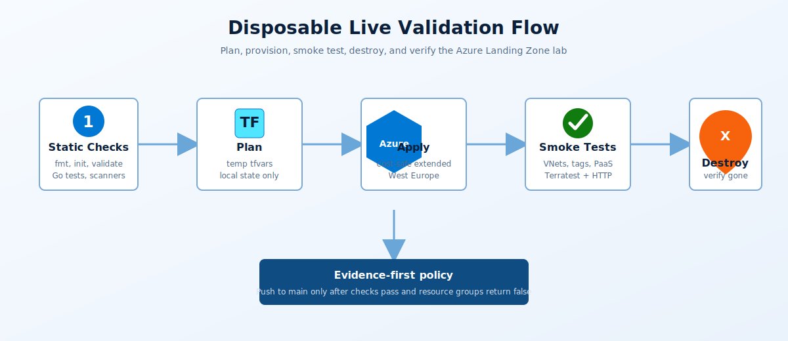

# Live provisioning validation

<p align="center">
  
</p>

Use this workflow when you need proof that the Azure Landing Zone lab can provision, pass smoke tests, and tear down cleanly. It is intentionally disposable and uses local Terraform state only.

## Command

Run from the repository root:

```powershell
.\scripts\invoke-live-validation.ps1
```

Useful options:

```powershell
.\scripts\invoke-live-validation.ps1 -Location "West Europe" -Environment livetest
.\scripts\invoke-live-validation.ps1 -SubscriptionId "<subscription-id>"
.\scripts\invoke-live-validation.ps1 -SkipSmokeTests
.\scripts\invoke-live-validation.ps1 -KeepResources
```

`-KeepResources` is for debugging only. When it is set, destroy is skipped and local state must be preserved so the same checkout can destroy later.

## Live profile

The script creates a temporary tfvars file and backend-free Terraform workdir outside the repository. It does not use or modify `terraform.tfvars` or the shared remote backend.

| Area | Setting |
|------|---------|
| Region | `West Europe` |
| Environment | `livetest` |
| State | Local backend with disposable state |
| On | Hub, identity, management, shared, prod/dev workload VNets, firewall, App Gateway, public Load Balancer, Key Vault, Storage, SQL, private DNS, private endpoints, Log Analytics, Workbooks, Static Web App, Functions, Container Apps, Logic Apps, Event Grid, Service Bus, App Service, Cosmos DB, Azure Policy audit assignments |
| Off | VPN, on-prem simulation, AKS, public jumpbox IP, public LB RDP NAT, VNet flow logs, Traffic Analytics, Connection Monitor, Backup, management groups, regulatory compliance, custom RBAC roles, cost budgets, scheduled start/stop |
| Secrets | Terraform-generated passwords stay in local state and are not printed |

## Validation matrix

Static checks:

```powershell
terraform fmt -check -recursive
terraform init -backend=false
terraform validate
go mod download
go test ./...
```

The script also runs Checkov and Gitleaks when those tools are installed locally. If they are missing, GitHub Actions remains the blocking security gate.

Live checks after apply:

| Check | Expected result |
|-------|-----------------|
| Resource groups | Hub, identity, management, shared, workload-prod, and workload-dev exist |
| Tags | Required tags exist on every resource group |
| VNets | All six landing-zone VNets exist |
| Peering | Hub VNet has spoke peerings |
| Core platform | Firewall, App Gateway, Load Balancer, Key Vault, Storage, SQL, private endpoints, private DNS, and Log Analytics exist |
| PaaS | Static Web App, Function App, Container App, Logic App, Event Grid, Service Bus, App Service, and Cosmos DB exist |
| Workload | Load Balancer HTTP endpoint responds after bounded retry |
| Terratest | Go integration tests pass with live Azure resource names |

## Failure handling

If plan, apply, smoke tests, or Terratest fail, the script still runs `terraform destroy` unless `-KeepResources` was explicitly set. Logs stay in `%TEMP%\alz-live-validation-<timestamp>\logs`.

Fix code only after confirming destroy has completed or after deliberately preserving state with `-KeepResources` for investigation.

## Teardown verification

The run is considered clean only when:

- `terraform destroy -auto-approve` completes.
- `az group exists` returns `false` for each expected live resource group.
- `terraform state list` is empty.
- No `terraform.tfstate`, plan files, temp tfvars, logs, or generated evidence are staged.

## Related pages

- [Lab testing guide](lab-testing-guide.md)
- [Pipeline reference](../reference/pipeline.md)
- [Remote state and secrets](../reference/state-and-secrets.md)
